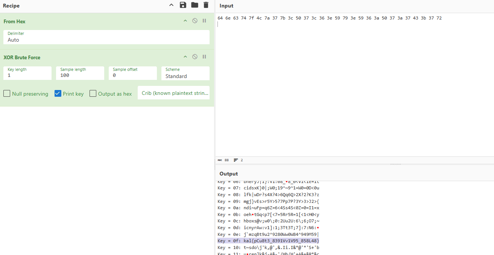
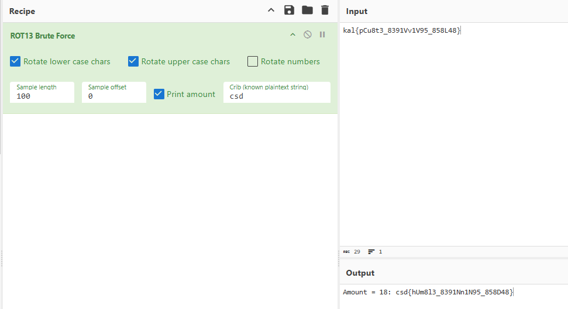

# Logical Exclusivity

- Published: 12/01/2024 (#1/25 in event)
- Category: Cryptography
- Points: 30
- Author: GodderE2D

rotten bxgxnnxngs

`64 6e 63 74 7f 4c 7a 37 7b 3c 50 37 3c 36 3e 59 79 3e 59 36 3a 50 37 3a 37 43 3b 37 72`

## Hints

**Hint 1:** Logical exclusivity = a logical operator?

**Hint 2:** CyberChef is your friend. Check out some brute forcing tools!

## Write-up

Reveal write-up

Upon opening the challenge we are presented with a hex string which we can tell since the string only contains
characters between A-F and 0-9. The challenge having the title Logical Exclusivity hints at utilizing something called
Exclusive or (XOR). So now we have some information we can work with, lets try using CyberChef to decode from Hex and
its Xor Bruteforce tool.

Out of all the keys CyberChef used, 0f had the most similar to the csd{} format with potentially readable 1337speek text
in it. In the description we seem to have a hint towards the next encoding, ROT otherwise know as Caeser Cipher. We know
we have to use Rot because of the clever play on words "rotten bxgxnnxngs", but the only way to know for sure is to try
so lets decrypt the string we just found with CyberChef's ROT Bruteforce.

YES, we got the flag! And it was as easy as From Hex > Bruteforcing Xor > Bruteforcing ROT13 > Searching with "csd" as
our crib (A known piece of plaintext) > Flag.

Flag: `csd{hUm8l3_8391Nn1N95_858D48}`

Write-up by zarnex
