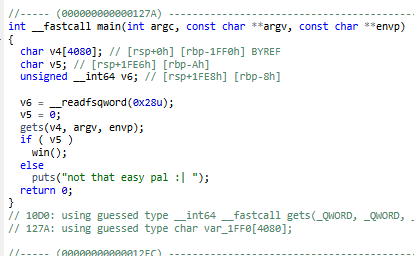
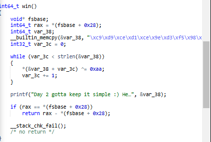

# screaming

- Published: 12/02/2024 (#2/25 in event)
- Category: Reverse engineering
- Points: 40
- Author: Vip3r

AAAAA- I'm not screaming, I'm just buffer overflowing my emotions!

## Attachments

- [chall](https://files.vipin.xyz/api/public/dl/RUU8-57Z/advent-of-ctf-csd/screaming/chall)

## Hints

**Hint 1:** Try decompiling it, dogbolt.org is good for that.

**Hint 2:** Look at the buffer amount in the decompilations from dogbolt, try overflowing it by sending more than the
buffer.

## Write-up

<details>
<summary>Reveal write-up</summary>

```bash
$ file chall
chall: ELF 64-bit LSB pie executable, x86-64, version 1 (SYSV), dynamically linked, interpreter /lib64/ld-linux-x86-64.so.2, BuildID[sha1]=69603fa57a0c6db8d144004964ce8f86db96f1f8, for GNU/Linux 3.2.0, not stripped
```

It seems as we are working with an ELF file, which is short for _Executable and Linkable Format_. Think of it as Linux's
version of a `.exe`. Lets run the program.

```bash
$ ./chall
give me flag!
not that easy pal :|
```

Well, that didn't help much but a decompilation could! A decompilation is the output of a decompiler which tries to make
sense of the machine readable code and represents it a higher-level, human readable language. A good free tool to get a
decompilation is [dogbolt.org](https://dogbolt.org/). Let's analyze our file with it.



Interesting, it seems as that there isn't a direct path to the flag. This could be a Buffer Overflow where we overflow
it by 1 more than the buffer (in this case it's 4080) and when it overflows it sets the value to True. Let's try to
overflow it!

```bash
$ python3 -c 'print("A" * 4081)' | ./chall # I used Python here to print out a large sum of characters. -c to run a command from the terminal
not that easy pal :|
$ python3 -c 'print("A" * 10000)' | ./chall
Day 2 gotta keep it simple :) Here is the flag: csd{d4y_2_H0w_r_u?}
*** stack smashing detected ***: terminated
[1]    1371982 done                           python3 -c 'print("A" * 10000)' |
       1371983 IOT instruction (core dumped)  ./chall
```

Wow, so it seems as our decompilation had failed us and showed us an incorrect buffer so I put a random buffer of 10 KB
and it seemed to have been enough. However with my testing, I had found another method to solve this which leads me to
believe why they made an annoucement on changing the category.

## Solution 2

```bash
(gdb) disas main
Dump of assembler code for function main:
   0x000055555555527a <+0>:     endbr64
   0x000055555555527e <+4>:     push   %rbp
   0x000055555555527f <+5>:     mov    %rsp,%rbp
   0x0000555555555282 <+8>:     sub    $0x1000,%rsp
   0x0000555555555289 <+15>:    orq    $0x0,(%rsp)
   0x000055555555528e <+20>:    sub    $0xff0,%rsp
   0x0000555555555295 <+27>:    mov    %fs:0x28,%rax
   0x000055555555529e <+36>:    mov    %rax,-0x8(%rbp)
   0x00005555555552a2 <+40>:    xor    %eax,%eax
   0x00005555555552a4 <+42>:    movb   $0x0,-0xa(%rbp)
   0x00005555555552a8 <+46>:    lea    -0x1ff0(%rbp),%rax
   0x00005555555552af <+53>:    mov    %rax,%rdi
   0x00005555555552b2 <+56>:    mov    $0x0,%eax
   0x00005555555552b7 <+61>:    call   0x5555555550d0 <gets@plt>
   0x00005555555552bc <+66>:    movzbl -0xa(%rbp),%eax
   0x00005555555552c0 <+70>:    test   %al,%al
   0x00005555555552c2 <+72>:    je     0x5555555552d0 <main+86>
   0x00005555555552c4 <+74>:    mov    $0x0,%eax
   0x00005555555552c9 <+79>:    call   0x5555555551c9 <win>
   0x00005555555552ce <+84>:    jmp    0x5555555552df <main+101>
   0x00005555555552d0 <+86>:    lea    0xd65(%rip),%rax        # 0x55555555603c
   0x00005555555552d7 <+93>:    mov    %rax,%rdi
   0x00005555555552da <+96>:    call   0x555555555090 <puts@plt>
   0x00005555555552df <+101>:   mov    $0x0,%eax
   0x00005555555552e4 <+106>:   mov    -0x8(%rbp),%rdx
   0x00005555555552e8 <+110>:   sub    %fs:0x28,%rdx
   0x00005555555552f1 <+119>:   je     0x5555555552f8 <main+126>
   0x00005555555552f3 <+121>:   call   0x5555555550b0 <__stack_chk_fail@plt>
   0x00005555555552f8 <+126>:   leave
   0x00005555555552f9 <+127>:   ret
End of assembler dump.
(gdb) b* 0x5555555552d0
Breakpoint 1 at 0x5555555552d0
(gdb) run
Starting program: /home/zarnex/advent_of_ctf/chall
[Thread debugging using libthread_db enabled]
Using host libthread_db library "/lib/x86_64-linux-gnu/libthread_db.so.1".


Breakpoint 1, 0x00005555555552d0 in main ()
(gdb) jump win
Continuing at 0x5555555551d1.
Day 2 gotta keep it simple :) Here is the flag: csd{d4y_2_H0w_r_u?}
[Inferior 1 (process 1374232) exited normally]
(gdb)

```

_Zarnex, what the hell is this?_ What i'm doing here is I am using a tool called a debugger which allows us to analyze
the binary more dynamically. What I did was I first ran the program because of _Address Space Layout Randomization
(ASLR)_ which randomizes the memory addresses that the binary uses. If I didn't run it, the addresses would be
completely different and I couldn't jump to `win()`. After I ran the program, I set a breakpoint at a random part of
main before the check and then jumped to the win function which just printed out the flag.

## Bonus: Solution 3

Looking at the win function we find this.



Now what is going on? It takes the hex string stored in `&var_38` and XOR's it by `0xAA`, so in theory we could just
reverse that as seen in
[**this**](<https://gchq.github.io/CyberChef/#recipe=From_Hex('Auto')XOR(%7B'option':'Hex','string':'0xAA'%7D,'Standard',false)&input=XHhjOVx4ZDlceGNlXHhkMVx4Y2VceDllXHhkM1x4ZjVceDk4XHhmNVx4ZTJceDlhXHhkZFx4ZjVceGQ4XHhmNVx4ZGZceDk1XHhkN1x4MDA&oeol=VT>)
Cyberchef Recipe.

Flag: `csd{d4y_2_H0w_r_u?}`

</details>

Write-up by zarnex
