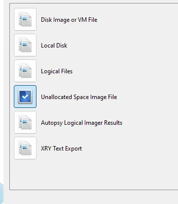
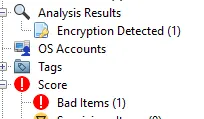
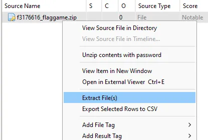
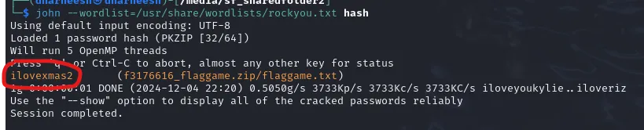
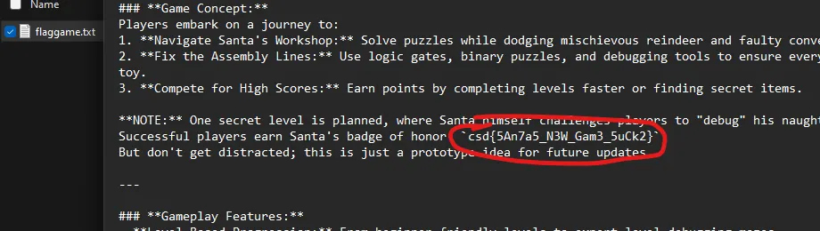

# long gone

- Published: 12/05/2024 (#5/25 in event)
- Category: Forensics
- Points: 75
- Author: Vip3r

Agent Elf, Agent Elf, wake up! Elf Tim's computer has been compromised by malware from a rogue elf. This malicious elf
has been secretly deleting critical files without anyone noticing—and it’s evident because Elf Tim's game in progress is
missing. Can you recover the deleted files? Some of them are password-protected—can you retrieve those too?

## Attachments

- [vm_disk_image.zip](https://cyberstudents.net/vm_disk_image.zip)

## Hints

**Hint 1:** Can’t figure out what tool to use? Try Autopsy, FTK Imager, or Binwalk.

**Hint 2:** The malware delete files? Or does it… Look around the FileSystem for files that may have been deleted.

## Write-up

Reveal write-up

Open the disk image in Autopsy but instead of choosing the data source as a disk image, chose unallocated space image
file.

Run all the ingest modules on the image file, it should automatically do that when you load the disk image in. You’ll
have to wait a while, but eventually, Autopsy finds a password-protected zip file. It is marked in bad items and in the
encryption detected section.

Once we see the file, we can right click and extract it.

The next part is now to crack the password. Run `zip2john ZIPFILENAME > hash` and then run
`john --wordlist=/usr/share/wordlists/rockyou.txt hash` to get the password.

Now just extract the zip file and view the text file inside of it to get the flag.

Flag: `csd{5An7a5_N3W_Gam3_5uCk2}`

Write-up by dharneesh5555
