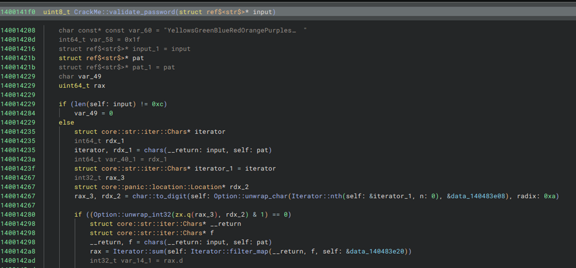
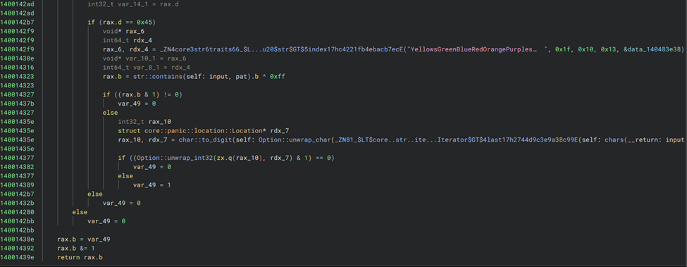

# Rusty Lock

- Published: 12/05/2024 (#5/25 in event)
- Category: Reverse engineering
- Points: 110
- Author: Logix

This is a classic crackme. Figure out all the checks on the license key to create your own. When a successful key is
detected it contacts a web url to grab your flag. If there are any web server errors DM ladderlogix on Discord.

## Attachments

- [CrackMe](https://files.vipin.xyz/api/public/dl/A9y5pVFl/Day%203%20-%20Rusty%20Lock/CrackMe)
- [CrackMe.exe](https://files.vipin.xyz/api/public/dl/GnKkBjrV/Day%203%20-%20Rusty%20Lock/CrackMe.exe)
- [CrackMe.pdb](https://files.vipin.xyz/api/public/dl/q3LkPi-f/Day%203%20-%20Rusty%20Lock/CrackMe.pdb)

## Hints

**Hint 1:** Binary Ninja can load pdb files to add in reverse engineering. In addition dynamic debuggers like gdb, or
lldb can help show what checks are being performed.

**Hint 2:** There are 5 checks being made. They check the license for numbers and letters. The check function is
`CrackMe::validate_password` located at `0x1400141f0`

## Write-up

Reveal write-up

Start by putting the binary and the pdb file in the same folder and open the exe file in binary ninja. The find the
`CrackMe::validate_password` function and relabeled symbols to get an understanding of what is happening. There are 5
checks done:

1. password length must be 12
2. first digit must be even
3. sum of the digits should be 69
4. the password must contain a substring from the variable `pat`, which is a substring of:
   `YellowsGreenBlueRedOrangePurplesrc\\main.rs`
5. last digit is odd

Here is the relabeled function in binary ninja:

For the 4th condition, it is possible to find exactly which substring from `pat` must be included in the password, but I
didn’t check the function in detail because it seems like a lot of work. I assumed there is some kind of slicing being
done. Knowing this information, I just bruteforced the 4th condition. Ignoring that condition for now, I crafted this
string: `8XXXX7999999`, which respects the other four conditions. Now, I just replaced `XXXX` with a different substring
of `YellowsGreenBlueRedOrangePurplesrc\\main.rs` until `8eRed7999999` gave the flag.

Flag: `csd{V41id_L1ceNs3_K3y}`

Write-up by raul_26
