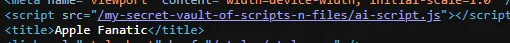
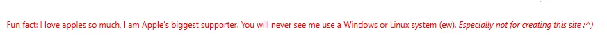
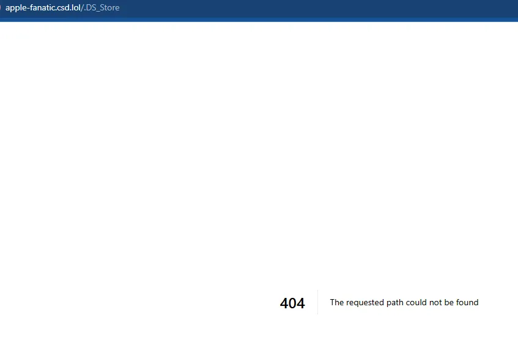
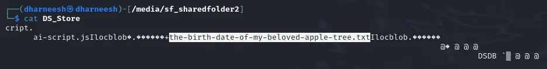
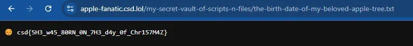

# Apple Fanatic

- Published: 12/07/2024 (#7/25 in event)
- Category: Web exploitation
- Points: 60
- Author: GodderE2D

Welcome to the bunker, agent. We’ve evaluated your performance in solving (and guessing) our formative challenges and
are excited to offer you a trial position at Elves Intelligence.

It appears that a _secret society_ has become interested in our immense data on the world’s children—including names,
birthdates, likes, dislikes, and social security numbers. (Don’t ask me why we store their social security numbers in
plain text.)

Here at Elves Intelligence, we stop our threats at the source. The best defense is a good offense. (Usually?)

A member of the secret society dropped a note in Santa’s presents sack overnight. Somehow, they got past our sleeping
elf watching the security cameras. Thankfully, the person didn’t seem to know
[OPSEC](https://en.wikipedia.org/wiki/Operations_security) and included their personal website on the note. The note
read:

> We will be watching you.  
> \- The Secret Society of K.U.N.A.L  
> [https://apple-fanatic.csd.lol/](https://apple-fanatic.csd.lol/)

The only thing they’ve taken with them is an apple from the sack of presents. Weird.

Our top SOC elves gathered two pieces of information from their initial observation of the site:

1. This person seems to like apples. Like, a lot.
2. The person claims a flag is intricately hidden on the site under a name that no one will be able to guess.

Good luck, agent. Santa is watching.

---

_**You are only allowed to test in the scope `https://apple-fanatic.csd.lol/*`.** Blind brute-force request sending
(e.g. using tools like DirBuster) can trigger Cloudflare rate limits. Do not attempt to bypass Cloudflare limits.
Therefore, if you wish to brute-force, please limit your wordlists or attack scope._

## Hints

**Hint 1:** This person probably made their website on macOS. Do you know anything special macOS has but Windows or
Linux doesn’t? Could it be something that could be accessed through the website unbeknownst to the website’s author?

**Hint 2:** Try creating a folder on macOS. Sometimes, a special _hidden_ file appears.

## Write-up

Reveal write-up

The main takeaways are the fact that the flag is hidden on the site under a name that no one can guess. This probably
means that directory brute forcers won’t work. Let’s explore the site.

There’s a JavaScript file in the source code. Clicking on it doesn’t reveal anything interesting though. The interesting
thing to me is the folder this file is in. It’s `my-secret-vault-of-scripts-n-files`, weird. Let’s keep this in mind as
we explore the rest of the site. There is a clue given on the site.

when I saw that the person used an Apple device to make it, I immediately thought of a picoCTF challenge about a hidden
file called `.DS_Store`. I tried appending this to the URL but it didn’t give me anything.

What I had to do, and this took me a while to figure out, was to append `.DS_Store` to one of the other folders. For
example, https://apple-fanatic.csd.lol/my-secret-vault-of-scripts-n-files/.DS_Store will download a `DS_Store` file on
your machine. If we cat this out, we find something interesting.

The name of the file. Let’s append this to the end of `my-secret-vault-of-scripts-n-files`.

Flag: `csd{5H3_w45_80RN_0N_7H3_d4y_0f_Chr157M4Z}`

Write-up by Dharneesh5555
