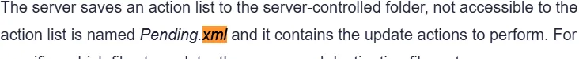

# vuln research

- Published: 12/08/2024 (#8/25 in event)
- Category: OSINT
- Points: 45
- Author: Vip3r

Santa needs your help to investigate the **Downdate** vulnerability! He has a few urgent questions about it that he
needs answered ASAP. Can you provide the answers to help keep the North Pole safe from these threats?

1. What is the surname of the researcher who discovered the Downdate vulnerability.
2. Which technology company is responsible for addressing the Downdate vulnerability?
3. What is the CVE identifier associated with the Windows Downdate vulnerability?
4. Which registry key is manipulated to disable Virtualization-Based Security (VBS) in the Windows Downdate exploit?
5. What is the name of the XML file that the Windows Downdate exploit manipulates to control the update process?
6. Which Windows kernel module is downgraded in the Windows Downdate proof-of-concept to exploit the
   "ItsNotASecurityBoundary" vulnerability?

Answer the questions with a single word @ `nc ctf.csd.lol 5000`

## Hints

**Hint 1:** Google will be your best friend; try searching up some of the specific words the questions are asking.

**Hint 2:** Use credible sources like CVE databases (e.g., NVD), security blogs, and announcements from technology
companies. These provide a lot of information about the vulnerability.

## Write-up

Reveal write-up

Most of these were easy, all of the questions except question 5 could be answered with this article. For question 5, you
could just copy and paste the question into google and click the first result.

Flag: `csd{d0wNda73_15_W31RD}`

Write-up by Dharneesh5555
