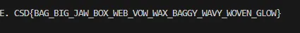

# Festive Encoding

- Published: 12/11/2024 (#11/25 in event)
- Category: Cryptography
- Points: 55
- Author: GodderE2D

"Agent! There you are. I got to take today off, sorry," said your elf mentor, "it's fine if I leave you at the office,
right? It's a slow day anyways..."

Your curiosity, of course, led you to Santa's office. You step into his glacial abode where he is sleeping gracefully.
_Actually, he snores pretty loudly._ Maybe, you'll find some of his secrets about children.

_Should I peak into the unlocked file cabinet?_ Your intrusive thoughts won, of course.

You take out a document, only to find it scattered with emojis. Perhaps, Santa wants to better relate to the children of
Generation Alpha? _He should've used words like rizz, Diddy, and fein instead._

"That's Festive Encoding, agent," muttered Santa behind you.

---

Try decoding the excerpt under "2024 Encoded" in the file to reveal the flag. Once you do, probably use it for blackmail
before you get fired.

## Attachments

- [festive_encoding.txt](https://files.vipin.xyz/api/public/dl/luiZO6ox/Day%2011%20-%20Festive%20Encoding/festive-encoding.txt)

## Hints

**Hint 1:**

Take a look at the encoded/decoded text for 2023—can you find the relationship between the letters and the emojis? Do
the same letters have the same emojis? What could that mean?

The 2024 encoded version looks similar too. Maybe they're related?

**Hint 2:**

You can create a map, where each letter maps to an emoji, by using the 2023 encoded/decoded text.

Now, try using your map. Substitute all the emojis you found in the map with the respective letter. You'll find that
there may be a few letters missing.

Don't worry—the flag doesn't really make sense. They're all English words, though.

However, you probably have a better chance at guessing the words scattered around the message instead.

## Write-up

<details>
<summary>Reveal write-up</summary>

I opened the file, I immediately knew it was a substitution cipher due to there being emojis in replacement for certain
characters. I made this script to decode the 2024 encoded part

```python
substitution_table = {
    "🦌": "D",
    "🔔": "E",
    "🎅": "A",
    "🎳": "R",
    "🎁": "C",
    "❄": "H",
    "⛄": "I",
    "🎶": "L",
    "🎤": "Y",
    "🎮": "O",
    "🎨": "U",
    "🎭": "T",
    "🕯": "F",
    "🎰": "S",
    "🎵": "M",
    "🎸": "N",
    "🎥": "W",
    "🎬": "V",
    "🌟": "J",
    "🎉": "G",
    "🎊": "K",
    "🎲": "P",
    "🎄": "B",
    "🎦": "X"

}

encoded_text = """
🦌🔔🎅🎳 🎁❄⛄🎶🦌,

⛄ 🎰🔔🔔 🎤🎮🎨 🦌⛄🦌🎸'🎭 🦌🎮 🎭❄🔔 🦌🎅⛄🎶🎤 🎁🎭🕯, 🎊⛄🦌.

🎥🔔🎶🎶, 🎤🎮🎨 🎊🎸🎮🎥 🎥❄🎅🎭 ❄🎅🎲🎲🔔🎸🎰 🎸🎮🎥.

🎤🎮🎨 🎰🔔🔔 🎭❄🎅🎭 🎲🔔🎳🎰🎮🎸 🎮🎨🎭🎰⛄🦌🔔 🎮🕯 🎤🎮🎨🎳 🎥⛄🎸🦌🎮🎥?

⛄🎸 🎭❄🔔 🎥❄⛄🎭🔔 🎬🎅🎸 🎥⛄🎭❄ 🎭❄🔔 🕯🎳🔔🔔 🎁🎅🎸🦌🎤 🎰⛄🎉🎸?

⛄ ❄🎅🦌 🎰🎮🎵🔔 🎶🔔🕯🎭🎮🎬🔔🎳🎰 🕯🎳🎮🎵 🎁❄🎳⛄🎰🎭🎵🎅🎰 🎶🎅🎰🎭 🎤🔔🎅🎳.

🎭❄🔔🎳🔔 🎥🔔🎳🔔 🎭🎮🎸🎰 🎮🕯 🎁❄⛄🎶🦌🎳🔔🎸 🎥❄🎮 🎲⛄🎁🎊🔔🦌 🎭❄🔔 🎮🎭❄🔔🎳 🎮🎲🎭⛄🎮🎸...

🎄🎨🎭 🎄🔔🕯🎮🎳🔔 🎤🎮🎨 🎉🔔🎭 ⛄🎸, ⛄ 🎵🎨🎰🎭 🎅🎰🎊:

🎅 🕯🎶🎅🎉 🎮🎳 🎤🎮🎨🎳 🕯🎅🎵⛄🎶🎤?

🎄🎨🎭 🎅🎳🔔 🎤🎮🎨 🎰🎨-- 🎮❄. 🎤🎮🎨 🎥🎅🎸🎭 🎭❄🔔 🕯🎶🎅🎉? 🎉🎮🎮🦌 🎁❄🎮⛄🎁🔔. 🎁🎰🦌{🎄🎅🎉_🎄⛄🎉_🌟🎅🎥_🎄🎮🎦_🎥🔔🎄_🎬🎮🎥_🎥🎅🎦_🎄🎅🎉🎉🎤_🎥🎅🎬🎤_🎥🎮🎬🔔🎸_🎉🎶🎮🎥}

⛄'🎶🎶 🎅🎰🎊 🎵🎤 🔔🎶🎬🔔🎰 🎭🎮 🎭🎅🎊🔔 🎁🎅🎳🔔 🎮🕯 🎤🎮🎨🎳 🕯🎅🎵⛄🎶🎤 🎸🎮🎥.

🦌🎮🎸'🎭 🕯🎮🎳🎉🔔🎭 🎭🎮 ❄🎅🎬🔔 🎰🎮🎵🔔 🕯🎅🎵⛄🎶🎤 🎭⛄🎵🔔!

❄🎅🎬🔔 🎅 ❄🎮🎶🎶🎤 🌟🎮🎶🎶🎤 🎁❄🎳⛄🎰🎭🎵🎅🎰!

🎰🎅🎸🎭🎅

"""

def decode_text(encoded, table):
    decoded = ""
    for char in encoded:
        if char in table:
            decoded += table[char]
        else:
            decoded += char
    return decoded

decoded_text = decode_text(encoded_text, substitution_table)

print("Decoded Text:")
print(decoded_text)

```

The letter X for the emoji 🎦 was actually guessed because it made the most reasonable word.



Flag: `csd{bag_big_jaw_box_web_vow_wax_baggy_wavy_woven_glow}`

</details>

Write-up by Dharneesh5555
