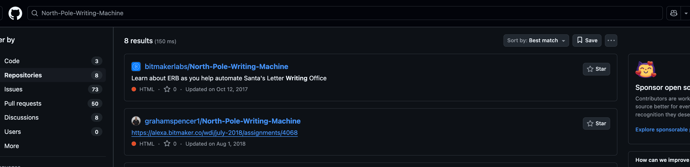

# Letter To Santa

- Published: 12/12/2024 (#12/25 in event)
- Category: Forensics
- Points: 85
- Author: Logix

A child sent Santa a letter but he forgot to include the password can you figure it out. **YOU DO NOT NEED TO BRUTE
FORCE**

## Attachments

- [North-Pole-Writing-Machine.zip](https://bucket.ics.red/North-Pole-Writing-Machine.zip)

## Hints

**Hint 1:**

Maybe you are taking too many bites out of the cookie you might want smaller bites.

**Hint 2:**

Santa's elfs knew that the child who sent the letter used the original letter sending application.

## Write-up

<details>
<summary>Reveal write-up</summary>

I started off by downloading the file with `wget`.

```bash
$ file North-Pole-Writing-Machine.zip
North-Pole-Writing-Machine.zip: Zip archive data, at least v2.0 to extract, compression method=store
$ unzip North-Pole-Writing-Machine.zip
Archive:  North-Pole-Writing-Machine.zip
   creating: North-Pole-Writing-Machine/
[North-Pole-Writing-Machine.zip] North-Pole-Writing-Machine/.env password:
password incorrect--reenter:
password incorrect--reenter:
   skipping: North-Pole-Writing-Machine/.env  incorrect password
   creating: North-Pole-Writing-Machine/.git/
[North-Pole-Writing-Machine.zip] North-Pole-Writing-Machine/.git/config password:
   skipping: North-Pole-Writing-Machine/.git/config  incorrect password
   skipping: North-Pole-Writing-Machine/.git/description  incorrect password
   skipping: North-Pole-Writing-Machine/.git/HEAD  incorrect password
   creating: North-Pole-Writing-Machine/.git/hooks/
   skipping: North-Pole-Writing-Machine/.git/hooks/applypatch-msg.sample  incorrect password
   skipping: North-Pole-Writing-Machine/.git/hooks/commit-msg.sample  incorrect password
   skipping: North-Pole-Writing-Machine/.git/hooks/fsmonitor-watchman.sample  incorrect password
   skipping: North-Pole-Writing-Machine/.git/hooks/post-update.sample  incorrect password
   skipping: North-Pole-Writing-Machine/.git/hooks/pre-applypatch.sample  incorrect password
   skipping: North-Pole-Writing-Machine/.git/hooks/pre-commit.sample  incorrect password
   skipping: North-Pole-Writing-Machine/.git/hooks/pre-merge-commit.sample  incorrect password
   skipping: North-Pole-Writing-Machine/.git/hooks/pre-push.sample  incorrect password
   skipping: North-Pole-Writing-Machine/.git/hooks/pre-rebase.sample  incorrect password
   skipping: North-Pole-Writing-Machine/.git/hooks/pre-receive.sample  incorrect password
   skipping: North-Pole-Writing-Machine/.git/hooks/prepare-commit-msg.sample  incorrect password
   skipping: North-Pole-Writing-Machine/.git/hooks/push-to-checkout.sample  incorrect password
   skipping: North-Pole-Writing-Machine/.git/hooks/update.sample  incorrect password
   skipping: North-Pole-Writing-Machine/.git/index  incorrect password
   creating: North-Pole-Writing-Machine/.git/info/
   skipping: North-Pole-Writing-Machine/.git/info/exclude  incorrect password
   creating: North-Pole-Writing-Machine/.git/logs/
   skipping: North-Pole-Writing-Machine/.git/logs/HEAD  incorrect password
   creating: North-Pole-Writing-Machine/.git/logs/refs/
   creating: North-Pole-Writing-Machine/.git/logs/refs/heads/
   skipping: North-Pole-Writing-Machine/.git/logs/refs/heads/master  incorrect password
   creating: North-Pole-Writing-Machine/.git/logs/refs/remotes/
   creating: North-Pole-Writing-Machine/.git/logs/refs/remotes/origin/
   skipping: North-Pole-Writing-Machine/.git/logs/refs/remotes/origin/HEAD  incorrect password
   creating: North-Pole-Writing-Machine/.git/objects/
   creating: North-Pole-Writing-Machine/.git/objects/info/
   creating: North-Pole-Writing-Machine/.git/objects/pack/
   skipping: North-Pole-Writing-Machine/.git/objects/pack/pack-b83ec11042642601eca2115dfcc114f66f4c32ec.idx  incorrect password
   skipping: North-Pole-Writing-Machine/.git/objects/pack/pack-b83ec11042642601eca2115dfcc114f66f4c32ec.pack  incorrect password
   skipping: North-Pole-Writing-Machine/.git/packed-refs  incorrect password
   creating: North-Pole-Writing-Machine/.git/refs/
   creating: North-Pole-Writing-Machine/.git/refs/heads/
   skipping: North-Pole-Writing-Machine/.git/refs/heads/master  incorrect password
   creating: North-Pole-Writing-Machine/.git/refs/remotes/
   creating: North-Pole-Writing-Machine/.git/refs/remotes/origin/
   skipping: North-Pole-Writing-Machine/.git/refs/remotes/origin/HEAD  incorrect password
   creating: North-Pole-Writing-Machine/.git/refs/tags/
   skipping: North-Pole-Writing-Machine/.gitignore  incorrect password
   creating: North-Pole-Writing-Machine/data/
   skipping: North-Pole-Writing-Machine/data/kids-data.txt  incorrect password
   creating: North-Pole-Writing-Machine/letters/
   creating: North-Pole-Writing-Machine/letters/invoices/
   skipping: North-Pole-Writing-Machine/letters/invoices/.keep  incorrect password
   creating: North-Pole-Writing-Machine/letters/naughty/
   skipping: North-Pole-Writing-Machine/letters/naughty/.keep  incorrect password
   creating: North-Pole-Writing-Machine/letters/nice/
   skipping: North-Pole-Writing-Machine/letters/nice/.keep  incorrect password
   skipping: North-Pole-Writing-Machine/nice_letter_writer.rb  incorrect password
   skipping: North-Pole-Writing-Machine/README.md  incorrect password
   creating: North-Pole-Writing-Machine/templates/
   skipping: North-Pole-Writing-Machine/templates/invoice_sample_letter.txt  incorrect password
   skipping: North-Pole-Writing-Machine/templates/naughty_sample_letter.txt  incorrect password
   skipping: North-Pole-Writing-Machine/templates/nice_letter_template.txt.erb  incorrect password
```

The `file` command indeed verified that it was a ZIP file which crossed out it potentially being something else and it
is password protected. The challenge description states **_"YOU DO NOT NEED TO BRUTE FORCE"_**. This is really
interesting because typically you would need to crack a password protected ZIP, but we aren't supposed to. Let's get
some more information about this file with `zipinfo`...

```bash
$ 7z l -slt North-Pole-Writing-Machine.zip | head -n 60

7-Zip 23.01 (x64) : Copyright (c) 1999-2023 Igor Pavlov : 2023-06-20
 64-bit locale=en_US.UTF-8 Threads:4 OPEN_MAX:524288

Scanning the drive for archives:
1 file, 55927 bytes (55 KiB)

Listing archive: North-Pole-Writing-Machine.zip

--
Path = North-Pole-Writing-Machine.zip
Type = zip
Physical Size = 55927

----------
Path = North-Pole-Writing-Machine
Folder = +
Size = 0
Packed Size = 0
Modified = 2024-12-12 13:02:32.4356927
Created =
Accessed =
Attributes = D
Encrypted = -
Comment =
CRC =
Method = Store
Characteristics = NTFS
Host OS = FAT
Version = 20
Volume Index = 0
Offset = 0

Path = North-Pole-Writing-Machine/.env
Folder = -
Size = 71
Packed Size = 83
Modified = 2024-12-12 13:04:01.8125242
Created =
Accessed =
Attributes = A
Encrypted = +
Comment =
CRC = 74D6659E
Method = ZipCrypto Store
Characteristics = NTFS : Encrypt
Host OS = FAT
Version = 20
Volume Index = 0
Offset = 57

# [Truncated for brevity] with head -n 60
```

`7z` is really good for getting more information about the file. I used `l` which lists contents of archive and `-slt`
which shows technical information for `l` (List) command. Now we see that the method of encryption is **ZipCrypto
Store**. _Zipcrypto_ is vulnerable encryption method where a user can exploit it if they have 8-12 bytes of known
information about the stored file.

So now we know we can use the Biham and Kocher plaintext attack on the ZIP since it uses _Zipcrypto_ and the perfect
tool for this is `BKcrack`. Lets use it, but before that we need to find the original repo.

All I did was search the name up on Github and I found this...



I assuming it is the oldest repo and the rest are all forks, lets download a single file. I picked `README.txt`. Now
let's use `Bkcrack` to crack it!

```bash
$ cat plaintext.txt
# ERB Templates: North Pole Writing Machine
$ bkcrack -C North-Pole-Writing-Machine.zip -c North-Pole-Writing-Machine/README.md -p plaintext.txt
bkcrack 1.7.1 - 2024-12-21
[19:59:09] Z reduction using 37 bytes of known plaintext
100.0 % (37 / 37)
[19:59:09] Attack on 214860 Z values at index 6
100.0 % (214860 / 214860)
[20:07:03] Could not find the keys.
```

I found this extremely odd because I thought it was the exact text but digging deeper I found this...

```bash
$ xxd plaintext.txt
00000000: 2320 4552 4220 5465 6d70 6c61 7465 733a  # ERB Templates:
00000010: 204e 6f72 7468 2050 6f6c 6520 5772 6974   North Pole Writ
00000020: 696e 6720 4d61 6368 696e 650a            ing Machine.
```

`0a`is the _Line Feed_ character, essentially meaning `\n` or end of line. If the system where the ZIP is generated is
Windows, it takes all the _Line Feeds_ and makes them _Carriage Return Line Feed (CRLF)_. Fix this issue I can remove
all Line Feeds with this command `tr -d '\n' < plaintext.txt > plaintext1.txt`. `-d` deletes all occurrences of `\n`
characters.

```bash
$ tr -d '\n' < plaintext.txt > plaintext1.txt
$ xxd plaintext1.txt
00000000: 2320 4552 4220 5465 6d70 6c61 7465 733a  # ERB Templates:
00000010: 204e 6f72 7468 2050 6f6c 6520 5772 6974   North Pole Writ
00000020: 696e 6720 4d61 6368 696e 65              ing Machine
```

As we can see, our LF character is gone. Let's try `bkcrack` once more!

```bash
$ bkcrack -C North-Pole-Writing-Machine.zip -c North-Pole-Writing-Machine/README.md -p plaintext1.txt
bkcrack 1.7.1 - 2024-12-21
[20:19:00] Z reduction using 36 bytes of known plaintext
100.0 % (36 / 36)
[20:19:01] Attack on 218338 Z values at index 6
Keys: 9310e3e7 c19b7b37 2e82342d
66.6 % (145420 / 218338)
Found a solution. Stopping.
You may resume the attack with the option: --continue-attack 145420
[20:24:38] Keys
9310e3e7 c19b7b37 2e82342d
```

Now that we have our keys we can do this...

```bash
$ bkcrack -C North-Pole-Writing-Machine.zip -k 9310e3e7 c19b7b37 2e82342d -D nopass.zip

bkcrack 1.7.1 - 2024-12-21
[21:11:52] Writing decrypted archive nopass.zip
100.0 % (37 / 37)

$ unzip nopass.zip
Archive:  nopass.zip
   creating: North-Pole-Writing-Machine/
 extracting: North-Pole-Writing-Machine/.env
   creating: North-Pole-Writing-Machine/.git/
 extracting: North-Pole-Writing-Machine/.git/config
 extracting: North-Pole-Writing-Machine/.git/description
 extracting: North-Pole-Writing-Machine/.git/HEAD
   creating: North-Pole-Writing-Machine/.git/hooks/
 extracting: North-Pole-Writing-Machine/.git/hooks/applypatch-msg.sample
 extracting: North-Pole-Writing-Machine/.git/hooks/commit-msg.sample
 extracting: North-Pole-Writing-Machine/.git/hooks/fsmonitor-watchman.sample
# Truncated for brevity
```

Yes we unlocked the ZIP! Time to search for the flag...

```bash
$ la
total 32K
drwxr-xr-x 2 zarnex zarnex 4.0K Dec 12 12:02 data
-rw-r--r-- 1 zarnex zarnex   71 Dec 12 12:04 .env
drwxr-xr-x 7 zarnex zarnex 4.0K Dec 23 21:14 .git
-rw-r--r-- 1 zarnex zarnex   36 Dec 12 12:02 .gitignore
drwxr-xr-x 5 zarnex zarnex 4.0K Dec 12 12:02 letters
-rw-r--r-- 1 zarnex zarnex  540 Dec 12 12:02 nice_letter_writer.rb
-rw-r--r-- 1 zarnex zarnex  126 Dec 12 12:02 README.md
drwxr-xr-x 2 zarnex zarnex 4.0K Dec 12 12:02 templates

$ la ../North-Pole-Writing-Machine-github-repo
total 28K
drwxr-xr-x 2 zarnex zarnex 4.0K Dec 23 23:20 data
drwxr-xr-x 8 zarnex zarnex 4.0K Dec 23 23:20 .git
-rw-r--r-- 1 zarnex zarnex   31 Dec 23 23:20 .gitignore
drwxr-xr-x 5 zarnex zarnex 4.0K Dec 23 23:20 letters
-rw-r--r-- 1 zarnex zarnex  516 Dec 23 23:20 nice_letter_writer.rb
-rw-r--r-- 1 zarnex zarnex  123 Dec 23 23:20 README.md
drwxr-xr-x 2 zarnex zarnex 4.0K Dec 23 23:20 templates
```

There seems to be a `.env` folder in the challenge ZIP but not the original ZIP; I wonder what's inside it...

```bash
$ cat .env
Enviroment Variables
--------------------
c​sd{Uns3cu4e_Encrypti0n}%
```

Yes finally!!!!

Flag: `c​sd{Uns3cu4e_Encrypti0n}`

</details>

Write-up by zarnex
