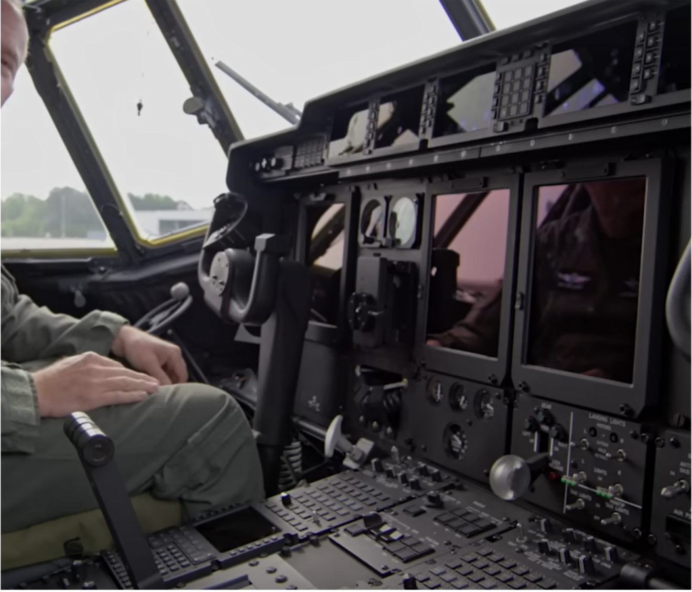

# Santa's Plane

- Published: 12/17/2024 (#17/25 in event)
- Category: OSINT
- Points: 80
- Author: Logix

Santa cargo plane is running into issues can mechanical problems. Can you figure out his plane model. Please include the
variant in the answer.

Ex. csd{a10}

## Attachments

- [pic1.webp](https://bucket.ics.red/pic1.webp)
- [pic2.webp](https://bucket.ics.red/pic2.webp)

## Hints

**Hint 1:**

We see that rank maybe a military plane?

**Hint 2:**

What US planes are currently being used for cargo transit

## Write-up

<details>
<summary>Reveal write-up</summary>

This was an easy one. I searched up Cargo aircraft since the CTF mentioned a cargo and got to this
[page](https://en.wikipedia.org/wiki/Cargo_aircraft)

While reading it I found:

```
But it was the introduction of the turboprop that allowed the class to mature, and even one of its earliest examples, the C-130 Hercules, in the 21st century as the Lockheed Martin C-130J, is still the yardstick against which newer military transport aircraft designs are measured. Although larger, smaller and faster designs have been proposed for many years, the C-130 continues to improve at a rate that keeps it in production.
```

This paragraph mentions Lockheed Martin C-130J, So I searched up it on Youtube to see what it looks like from inside.

This is what I found:



This picture of cockpit matches the second picture, so the aircraft we're looking for is Lockheed Martin C-130J (C130J)

Flag: `csd{c130j}`

</details>

Write-up by .jstr\_
