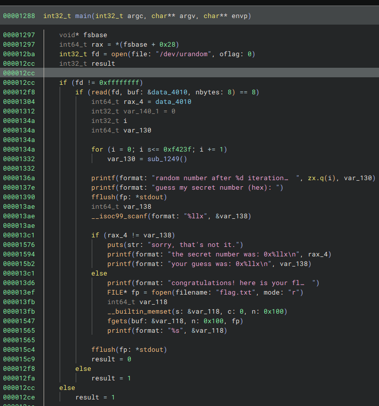

# trng

- Published: 12/18/2024 (#18/25 in event)
- Category: Reverse engineering
- Points: 100
- Author: Kolmus

True random numbers can’t hurt you … they’re not real. (Or are they?)

It looks like somebody is trying to hide your presents? Can you go trace them back and figure out their secrets?

Connect using `nc ctf.csd.lol 5040`.

## Attachments

- [trng_urandom](https://files.vipin.xyz/api/public/dl/cahks1Bo/Day%2018%20-%20trng/trng_urandom)
- [trng](https://files.vipin.xyz/api/public/dl/60C6MyXD/Day%2018%20-%20trng/trng)

## Hints

**Hint 1:**

While you may not be able to predict the initial random number, it is possible to mathematically reverse the function
that is iterated over.

**Hint 2:**

The function messing with the initial random number is a shorter implementation of an xorshift PRNG. The question is:
how do you reverse xorshift?

## Write-up

<details>
<summary>Reveal write-up</summary>

First, I opened the binary in binary ninja and saw the main function:



And this additional function:


Basically, this program encodes a random number by iterating 1,000,000 times over it and applying the `sub_1249()`
function. To get the flag, it is needed to "guess" the random number before this encoding process. To reverse the
encoding, I used [this article](https://tobtu.com/blog/2023/3/breaking-xor-shift-prng/), which explains how to break xor
shift. Let's take the example from the article:

```
y = x ^ (x >> 3)
```

y is known, and x needs to be found. Let's say y and x are both 8 bits and represent each bit as a letter:

```
y = ijklmnop

x = abcdefgh
```

From `y = x ^ (x >> 3)` it can be said that:

```
(eq1)

abcdefgh  ^
000abcde
--------
ijklmnop
```

It can be seen that `ijk=abc` since `a^0=a`, so just by looking at y the first 3 bits of x are known. In the article,
there are more details on how they found the following formula:

```
x = y ^ (y >> 3) ^ (y >> 6)
```

But basically it states that (remember the x and y notations):

```
(eq2)

abclmnop  ^
000abclm  ^
000000ab
--------
abcdefgh
```

Alright, the first 3 bits make sense, what about the rest, why is this true? Well, looking at (eq1) `l=a^d` and we want
to get `d`, which is the initial bit of x (we are looking for x remember?) so by doing `l^a` we get `d`. For `m` `n` the
similar logic is applied. Finally, for the last two bits it is known that `o=g^d` and `l=a^d`, thus from (eq2) we have
`g^d^a^d^a` which is exactly `g` (similar logic is for the last bit). In the article, there is also a more general
formula:

```c++
x = y;
for (i = 1; i * shift < bitSize; i++)
  x ^= y >> (i * shift);
```

This is the most important part. In this case the bitSize is 64 so to reverse the encoding I did:

```python

import numpy as np

def reverse_sub_1249(data_4010):

     a = data_4010 ^ (data_4010 >> 9) ^ (data_4010 >> 18) ^ (data_4010 >> 27) ^ (data_4010 >> 36) ^ (data_4010 >> 45) ^ (data_4010 >> 54) ^ (data_4010 >> 63)
     z = a  ^ (a << 7) ^ (a << 14) ^ (a << 21) ^ (a << 28) ^ (a << 35)  ^ (a << 42)  ^ (a << 49)  ^ (a << 56)  ^ (a << 63)
     return z


data_4010 = np.uint64(0xe415efccd9f117c4)

for i in range(0,1000000):
    data_4010 = reverse_sub_1249(data_4010)
print(f"Recovered x: {data_4010:#016x}")
```

Basically, I just applied the general formula and did the calculations in the opposite order. The numpy function just
bounds the variable `data_4010` to not exceed 64 bits. Then I just connected to the server, used the encoded hex values
printed as input for my program, and got the secret number.

Flag: `csd{M47H_15nT_7H4t_5cARY_N0w_15_I7?}`

</details>

Write-up by raul_26
