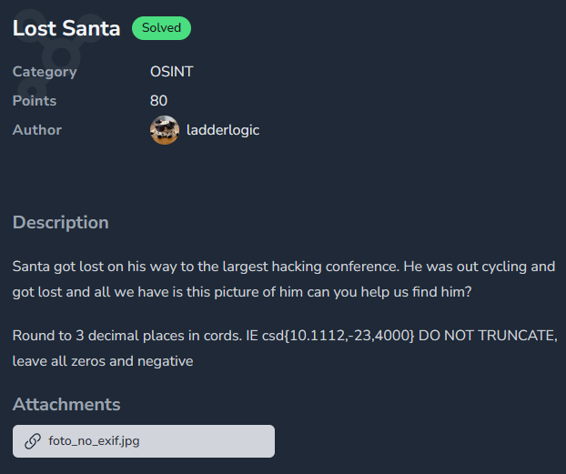

# Lost Santa

- Published: 12/20/2024 (#20/25 in event)
- Category: OSINT
- Points: 80
- Author: Logix

Santa got lost on his way to the largest hacking conference. He was out cycling and got lost and all we have is this
picture of him can you help us find him?

Round to 3 decimal places in cords. IE csd{10.111,-23,400} DO NOT TRUNCATE, leave all zeros and negative

## Attachments

- [foto_no_exif.jpg](https://bucket.ics.red/foto_no_exif.jpg)

## Hints

**Hint 1:**

What cycling event is there?

**Hint 2:**

What is the largest hacking conference?

## Write-up

Reveal write-up

I started by using Google Images and I discovered this post:

Which told me the location. I also saw an article about picnic areas, and because of the wall in the picture, I used the
following search query in Google Maps: `Picnic Area Red Rock National Conservation Area`. I then found
`Red Rock Canyon Overlook` and tried to find the approximate spot from where the picture was taken.

Flag: `csd{36.117,-115.445}`

Write-up by raul_26
